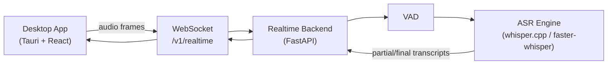
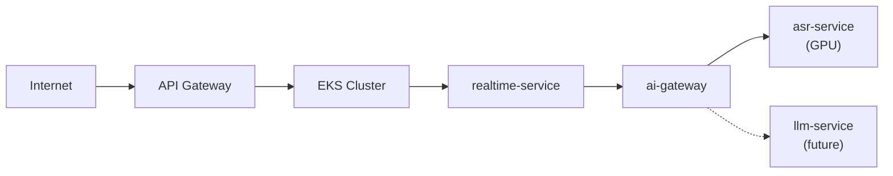

# Voragon Technical Documentation

Voragon is a local-first, realtime AI assistant platform. The initial product is realtime voice-to-text; the long-term goal is an extensible AI inference platform supporting speech recognition, transcription, contextual assistance, LLM inference, and additional model capabilities.

**Status:** Phase 0 complete. Implementation proceeds via dev-steps (one PR each). See [Dev-Steps Index](roadmap/dev-steps-index.md).

## How to Read This Documentation

| Audience | Start here |
|----------|------------|
| New engineer | [Architecture Overview](architecture/overview.md) → [Local Development](operations/local-development.md) |
| Desktop engineer | [Desktop Architecture](architecture/desktop.md) → [Realtime WebSocket API](api/realtime-websocket.md) |
| Backend / ML engineer | [Backend Architecture](architecture/backend.md) → [Model Serving](architecture/model-serving.md) → [Realtime Audio](architecture/realtime-audio.md) |
| Platform / DevOps engineer | [Kubernetes Architecture](architecture/kubernetes.md) → [AWS Strategy](architecture/aws.md) → [Operations](operations/) |
| Product / planning | [Development Phases](roadmap/phases.md) → [Future Capabilities](roadmap/future.md) |

## Documentation Map

```
docs/
├── README.md                          ← You are here
├── architecture/                      ← System design and component boundaries
├── decisions/                         ← Architecture Decision Records (ADRs)
├── api/                               ← Protocol and API contracts
├── operations/                        ← How to run and deploy
└── roadmap/                           ← Phased delivery plan
```

## Core Principles

1. **Local-first** — Development and default user experience run on the local machine.
2. **API-first** — Desktop, backend, and inference are connected through versioned APIs.
3. **Model-agnostic** — ASR and future model types are abstracted behind gateways and interfaces.
4. **Explicit service boundaries** — Desktop does not embed inference logic.
5. **Observable by default** — Metrics, tracing, and latency budgets are designed in from the start.
6. **Simple initial system** — One engineer can build and operate the MVP; complexity is added when justified.

## Architecture at a Glance

### Local Development (Phase 1–4)



### Production Target (Phase 6–8)



## Document Index

### Architecture

| Document | Description |
|----------|-------------|
| [overview.md](architecture/overview.md) | System context, components, boundaries, NFRs |
| [desktop.md](architecture/desktop.md) | Tauri, Rust, React responsibilities |
| [realtime-audio.md](architecture/realtime-audio.md) | Audio pipeline, latency, session lifecycle |
| [backend.md](architecture/backend.md) | FastAPI realtime service design |
| [ai-gateway.md](architecture/ai-gateway.md) | Model routing, abstraction, policies |
| [model-serving.md](architecture/model-serving.md) | ASR backends, whisper.cpp vs faster-whisper |
| [kubernetes.md](architecture/kubernetes.md) | EKS layout, scaling, WebSocket challenges |
| [aws.md](architecture/aws.md) | GPU instance strategy, cost planning |

### Architecture Decision Records

| ADR | Decision |
|-----|----------|
| [ADR-001](decisions/ADR-001-tauri-react-typescript.md) | Tauri 2 + React + TypeScript for desktop |
| [ADR-002](decisions/ADR-002-rust-native-layer.md) | Rust native layer for OS integration |
| [ADR-003](decisions/ADR-003-python-fastapi-backend.md) | Python + FastAPI for realtime backend |
| [ADR-004](decisions/ADR-004-realtime-websocket.md) | WebSocket for realtime communication |
| [ADR-005](decisions/ADR-005-whisper-large-v3-turbo.md) | Whisper Large-v3 Turbo as initial ASR model |
| [ADR-006](decisions/ADR-006-local-first.md) | Local-first architecture |
| [ADR-007](decisions/ADR-007-separate-desktop-backend.md) | Separate desktop and backend processes |
| [ADR-008](decisions/ADR-008-ai-gateway.md) | AI Gateway for model abstraction |
| [ADR-009](decisions/ADR-009-kubernetes-eks.md) | Kubernetes / EKS for production |
| [ADR-010](decisions/ADR-010-gpu-node-pool.md) | Dedicated GPU node pool |
| [ADR-011](decisions/ADR-011-privacy-display-capture.md) | Privacy / display-capture architecture |

### API

| Document | Description |
|----------|-------------|
| [realtime-websocket.md](api/realtime-websocket.md) | WebSocket protocol, message types, session lifecycle |
| [transcription.md](api/transcription.md) | Transcript semantics, partial vs final |
| [error-handling.md](api/error-handling.md) | Error codes, recovery, reconnect behavior |

### Operations

| Document | Description |
|----------|-------------|
| [local-development.md](operations/local-development.md) | Local dev setup (planned) |
| [docker.md](operations/docker.md) | Docker Compose layout (planned) |
| [kubernetes-local.md](operations/kubernetes-local.md) | Kind local cluster (planned) |
| [aws-deployment.md](operations/aws-deployment.md) | AWS EKS deployment guide (planned) |
| [observability.md](operations/observability.md) | Metrics, tracing, dashboards |

### Roadmap

| Document | Description |
|----------|-------------|
| [dev-steps-index.md](roadmap/dev-steps-index.md) | Dev-step registry (active step, status, PR links) |
| [dev-step-template.md](roadmap/dev-step-template.md) | Template for new dev-steps |
| [phases.md](roadmap/phases.md) | Phased development plan with dependencies |
| [future.md](roadmap/future.md) | Future capabilities and extension points |

## Development Workflow

Implementation follows the **dev-step** process:

1. Define the step in `docs/roadmap/dev-step-{phase}-{id}-{title}.md` before coding
2. Implement one verifiable behavior per PR
3. Update spec in the same PR if the implementation reveals needed changes
4. Run automated tests (required for code touched by the step)
5. Manual verification, then open PR
6. Merge before starting the next dev-step

Cursor rule: `.cursor/rules/dev-workflow.mdc`

## Terminology

| Term | Definition |
|------|------------|
| **Desktop App** | Tauri-based cross-platform client (React UI + Rust native layer) |
| **Realtime Backend** | Python FastAPI service handling WebSocket sessions and audio pipeline orchestration |
| **ASR** | Automatic Speech Recognition |
| **VAD** | Voice Activity Detection — determines when speech is present in an audio stream |
| **AI Gateway** | Internal service routing inference requests to model backends by capability alias |
| **API Gateway** | External entry point for authentication, rate limiting, and routing |
| **Partial transcript** | Interim transcription result that may be revised |
| **Final transcript** | Stable transcription result for a speech segment |
| **Session** | A single connected realtime transcription context |

## What Is Not Implemented Yet

This repository contains **documentation only**. The following do not exist yet:

- Application source code (Rust, TypeScript, Python)
- Dockerfiles and container images
- Kubernetes manifests
- Infrastructure-as-code (Terraform, etc.)
- Benchmark results or performance measurements

All latency targets and capacity estimates in this documentation are **engineering targets**, not measured guarantees.

## Related Documents Outside `docs/`

- [Project README](../README.md) — Top-level project entry point
