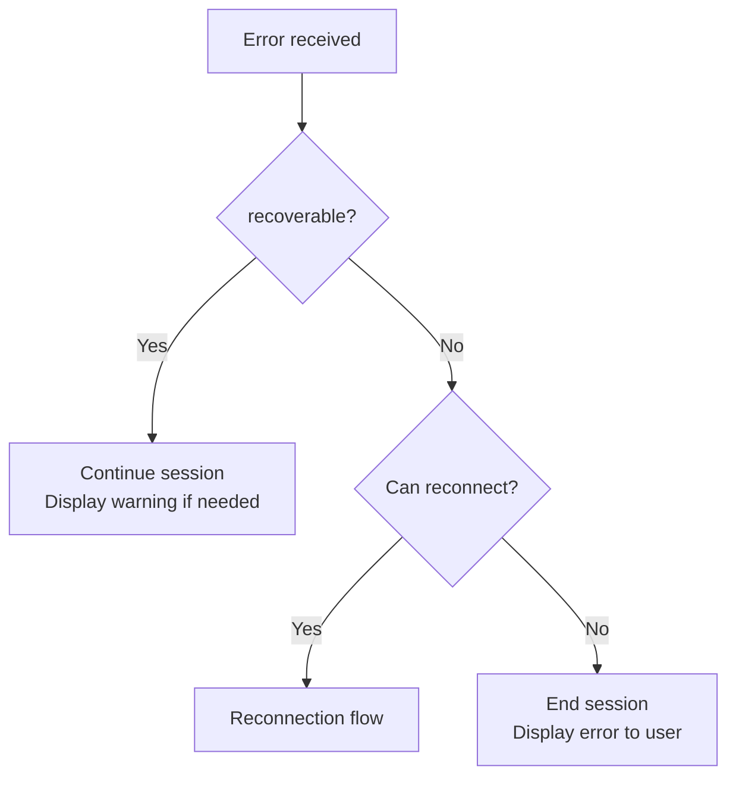
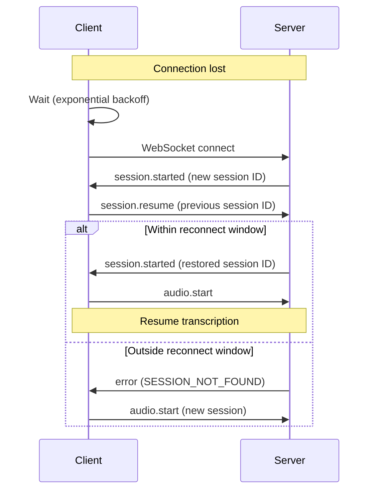

# Error Handling

## Overview

This document defines error codes, error message format, client recovery behavior, and reconnection protocol for the Voragon Realtime WebSocket API.

**Status:** Documented, not implemented.

## Error Message Format

Errors are delivered as `error` WebSocket messages:

```json
{
  "type": "error",
  "id": "msg-uuid",
  "session_id": "session-uuid",
  "timestamp": "2026-09-19T03:25:00.000Z",
  "payload": {
    "code": "ERROR_CODE",
    "message": "Human-readable error description",
    "recoverable": true,
    "details": {}
  }
}
```

| Field | Type | Description |
|-------|------|-------------|
| `code` | string | Machine-readable error code (see below) |
| `message` | string | Human-readable description |
| `recoverable` | boolean | Whether the client can continue the session |
| `details` | object | Additional context (optional) |

## Error Codes

### Connection Errors

| Code | Recoverable | Description | Client Action |
|------|-------------|-------------|---------------|
| `AUTH_FAILED` | No | Authentication failed | Re-authenticate and reconnect |
| `AUTH_EXPIRED` | No | JWT token expired | Refresh token and reconnect |
| `CONNECTION_REJECTED` | No | Server rejected connection (rate limit, capacity) | Wait and retry with backoff |
| `PROTOCOL_VERSION_UNSUPPORTED` | No | Client protocol version not supported | Update client |

### Session Errors

| Code | Recoverable | Description | Client Action |
|------|-------------|-------------|---------------|
| `SESSION_NOT_FOUND` | No | Session ID not found (resume failed) | Start new session |
| `SESSION_EXPIRED` | No | Session exceeded idle timeout | Start new session |
| `SESSION_LIMIT_REACHED` | No | Server at max concurrent sessions | Wait and retry |

### Audio Errors

| Code | Recoverable | Description | Client Action |
|------|-------------|-------------|---------------|
| `INVALID_AUDIO_FORMAT` | Yes | Audio frame format mismatch | Verify format matches `audio.start` config |
| `AUDIO_SEQUENCE_GAP` | Yes | Missing audio frame sequence numbers | Continue; log warning |
| `BUFFER_OVERFLOW` | Yes | Server audio buffer full, frames dropped | Display warning; continue |
| `AUDIO_NOT_STARTED` | Yes | `audio.chunk` sent before `audio.start` | Send `audio.start` first |

### Inference Errors

| Code | Recoverable | Description | Client Action |
|------|-------------|-------------|---------------|
| `ASR_INFERENCE_FAILED` | Yes | ASR model inference failed for a segment | Skip segment; continue session |
| `ASR_MODEL_UNAVAILABLE` | No | ASR model not loaded or unhealthy | Wait and retry; display error |
| `VAD_FAILED` | Yes | VAD processing failed | Degraded mode (pass all audio to ASR) |

### General Errors

| Code | Recoverable | Description | Client Action |
|------|-------------|-------------|---------------|
| `INVALID_MESSAGE` | Yes | Malformed message | Fix message format; continue |
| `UNKNOWN_MESSAGE_TYPE` | Yes | Unrecognized message type | Log warning; continue |
| `INTERNAL_ERROR` | No | Unexpected server error | Reconnect |

## Error Severity



| Severity | Recoverable | Session Impact | Example |
|----------|-------------|----------------|---------|
| Warning | Yes | None | `BUFFER_OVERFLOW`, `AUDIO_SEQUENCE_GAP` |
| Error | Yes | Degraded | `ASR_INFERENCE_FAILED`, `VAD_FAILED` |
| Fatal | No | Session ended | `AUTH_FAILED`, `ASR_MODEL_UNAVAILABLE` |

## Reconnection Protocol



### Reconnection Parameters

| Parameter | Value |
|-----------|-------|
| Max attempts | 5 |
| Initial backoff | 1 second |
| Backoff multiplier | 2× |
| Max backoff | 8 seconds |
| Reconnect window | 30 seconds |
| Total reconnect timeout | ~30 seconds (sum of backoffs) |

### Backoff Schedule

| Attempt | Wait Before Connect |
|---------|-------------------|
| 1 | 1 s |
| 2 | 2 s |
| 3 | 4 s |
| 4 | 8 s |
| 5 | 8 s |

After 5 failed attempts, the client stops reconnecting and displays an error to the user.

### State Recovery

On successful reconnect within the window:
- Session ID is restored
- Transcript history during the disconnect gap is lost
- Audio streaming resumes from the new connection
- No retroactive transcription of audio captured during disconnect (desktop does not buffer offline)

## Client Error Handling Guidelines

### Display

| Error Type | UI Treatment |
|-----------|-------------|
| Warning (recoverable) | Subtle indicator (icon, toast) |
| Error (recoverable) | Visible notification; session continues |
| Fatal (not recoverable) | Error dialog; session ends |
| Connection lost | "Reconnecting..." indicator with attempt count |

### Logging

- Log all error codes with `session_id` and timestamp
- Do not log audio content or transcript text in error logs (unless user opts in)
- Include `details` object for debugging

### Retry Logic

| Error | Retry Strategy |
|-------|---------------|
| `ASR_INFERENCE_FAILED` | Server retries once automatically; no client retry |
| `CONNECTION_REJECTED` | Client retries with backoff (up to 5 attempts) |
| `AUTH_EXPIRED` | Client refreshes token and reconnects |
| `BUFFER_OVERFLOW` | No retry; client may reduce frame rate (future) |

## Server Error Handling Guidelines

- Never crash the server process due to a single-session error
- Log errors with structured fields (`code`, `session_id`, `details`)
- Emit `error` message to client before taking corrective action
- For unrecoverable errors, emit `error` then `session.ended`
- Rate-limit error messages to prevent error storms (max 10 errors per second per session)

## Related Documents

- [Realtime WebSocket API](realtime-websocket.md)
- [Transcription API](transcription.md)
- [Realtime Audio Pipeline](../architecture/realtime-audio.md)
