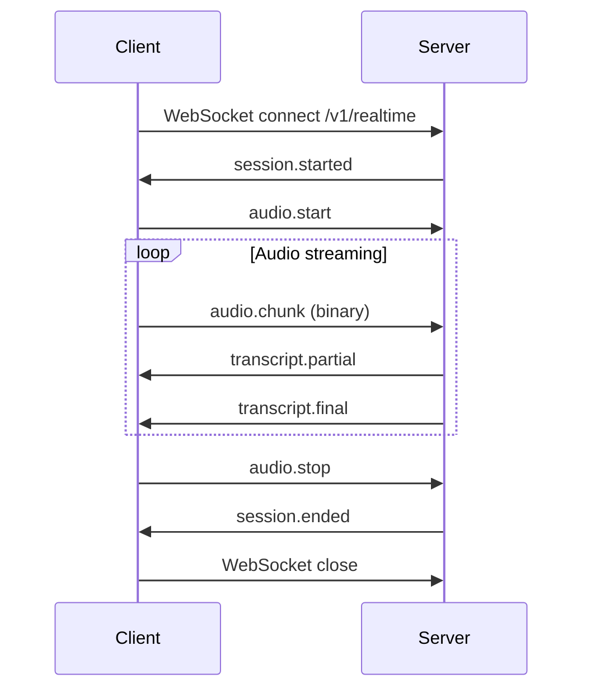

# Realtime WebSocket API

## Overview

The Realtime WebSocket API is the primary communication channel between the Voragon desktop application and the Realtime Backend. It handles session management, audio streaming, and transcript delivery.

**Status:** Documented, not implemented.

## Endpoint

| Environment | URL |
|-------------|-----|
| Local development | `ws://localhost:8000/v1/realtime` |
| Production | `wss://api.voragon.example/v1/realtime` |

The `/v1/` prefix enables future protocol versions (`/v2/realtime`) without breaking existing clients.

## Protocol Summary

| Message Type | Direction | Format | Description |
|-------------|-----------|--------|-------------|
| `audio.start` | Client → Server | JSON | Begin audio streaming |
| `audio.chunk` | Client → Server | Binary | Audio frame data |
| `audio.stop` | Client → Server | JSON | Stop audio streaming |
| `session.resume` | Client → Server | JSON | Resume a previous session |
| `ping` | Client → Server | JSON | Heartbeat |
| `session.started` | Server → Client | JSON | Session established |
| `transcript.partial` | Server → Client | JSON | Interim transcription |
| `transcript.final` | Server → Client | JSON | Final transcription for a segment |
| `error` | Server → Client | JSON | Error notification |
| `session.ended` | Server → Client | JSON | Session closed |
| `pong` | Server → Client | JSON | Heartbeat response |
| `buffer.overflow` | Server → Client | JSON | Audio buffer overflow warning |

## Connection Lifecycle



## Message Format

### Envelope (JSON Control Messages)

All JSON messages share a common envelope:

```json
{
  "type": "message.type",
  "id": "msg-uuid",
  "session_id": "session-uuid",
  "timestamp": "2026-09-19T03:25:00.000Z",
  "payload": { }
}
```

| Field | Type | Required | Description |
|-------|------|----------|-------------|
| `type` | string | Yes | Message type identifier |
| `id` | string (UUID) | Yes | Unique message ID |
| `session_id` | string (UUID) | Yes | Session identifier |
| `timestamp` | string (ISO 8601) | Yes | Message creation time (UTC) |
| `payload` | object | Yes | Type-specific payload |

### Binary Audio Frames

Audio frames are sent as **binary WebSocket messages** (not JSON). Each binary frame has a fixed header followed by raw PCM data:

```
┌──────────────────────────────────────────┐
│ Header (16 bytes)                        │
├──────────┬──────────┬──────────┬─────────┤
│ version  │ seq_num  │ timestamp│ payload │
│ (1 byte) │ (4 bytes)│ (8 bytes)│ length  │
│          │          │          │(4 bytes)│
├──────────┴──────────┴──────────┴─────────┤
│ PCM Data (variable)                      │
│ 16-bit signed LE, 16 kHz, mono          │
└──────────────────────────────────────────┘
```

| Header Field | Size | Type | Description |
|-------------|------|------|-------------|
| `version` | 1 byte | uint8 | Protocol version (currently `1`) |
| `seq_num` | 4 bytes | uint32 | Monotonically increasing sequence number |
| `timestamp` | 8 bytes | uint64 | Capture timestamp (microseconds since epoch) |
| `payload_length` | 4 bytes | uint32 | Length of PCM data in bytes |
| PCM data | variable | bytes | Raw s16le PCM audio (typically 640 bytes = 20 ms) |

Binary frames do not use the JSON envelope. The `session_id` is established by the session and implied by the WebSocket connection.

## Client Messages

### `audio.start`

Begin audio streaming for the session.

```json
{
  "type": "audio.start",
  "id": "msg-001",
  "session_id": "session-uuid",
  "timestamp": "2026-09-19T03:25:00.000Z",
  "payload": {
    "language": "en",
    "model": "asr.default",
    "sample_rate": 16000,
    "channels": 1,
    "sample_format": "s16le",
    "frame_duration_ms": 20
  }
}
```

| Field | Type | Default | Description |
|-------|------|---------|-------------|
| `language` | string | `"en"` | BCP-47 language code |
| `model` | string | `"asr.default"` | Capability alias for ASR model |
| `sample_rate` | int | `16000` | Audio sample rate in Hz |
| `channels` | int | `1` | Number of audio channels |
| `sample_format` | string | `"s16le"` | Sample format |
| `frame_duration_ms` | int | `20` | Frame duration in milliseconds |

### `audio.chunk`

Binary WebSocket message. See [Binary Audio Frames](#binary-audio-frames) above.

Sent continuously after `audio.start` at the configured frame rate (typically every 20 ms).

### `audio.stop`

Stop audio streaming. The session remains open.

```json
{
  "type": "audio.stop",
  "id": "msg-002",
  "session_id": "session-uuid",
  "timestamp": "2026-09-19T03:30:00.000Z",
  "payload": {}
}
```

### `session.resume`

Attempt to resume a previous session after reconnection.

```json
{
  "type": "session.resume",
  "id": "msg-003",
  "session_id": "previous-session-uuid",
  "timestamp": "2026-09-19T03:30:05.000Z",
  "payload": {}
}
```

### `ping`

Heartbeat message.

```json
{
  "type": "ping",
  "id": "msg-004",
  "session_id": "session-uuid",
  "timestamp": "2026-09-19T03:30:15.000Z",
  "payload": {}
}
```

## Server Messages

### `session.started`

Sent immediately after WebSocket connection is established.

```json
{
  "type": "session.started",
  "id": "msg-100",
  "session_id": "session-uuid",
  "timestamp": "2026-09-19T03:25:00.000Z",
  "payload": {
    "protocol_version": 1,
    "reconnect_window_s": 30
  }
}
```

### `transcript.partial`

Interim transcription result. May be revised by subsequent partials.

```json
{
  "type": "transcript.partial",
  "id": "msg-101",
  "session_id": "session-uuid",
  "timestamp": "2026-09-19T03:25:01.500Z",
  "payload": {
    "segment_id": "seg-uuid",
    "sequence": 3,
    "text": "Hello world how",
    "language": "en",
    "confidence": 0.92
  }
}
```

| Field | Type | Description |
|-------|------|-------------|
| `segment_id` | string (UUID) | VAD speech segment identifier |
| `sequence` | int | Monotonically increasing within segment |
| `text` | string | Transcription text (replaces previous partial for this segment) |
| `language` | string | Detected or configured language |
| `confidence` | float | Confidence score (0.0–1.0) |

### `transcript.final`

Final transcription for a completed speech segment.

```json
{
  "type": "transcript.final",
  "id": "msg-102",
  "session_id": "session-uuid",
  "timestamp": "2026-09-19T03:25:02.000Z",
  "payload": {
    "segment_id": "seg-uuid",
    "sequence": 4,
    "text": "Hello world how are you",
    "language": "en",
    "confidence": 0.95,
    "start_ms": 0,
    "end_ms": 2400
  }
}
```

| Field | Type | Description |
|-------|------|-------------|
| `start_ms` | int | Segment start offset in session (milliseconds) |
| `end_ms` | int | Segment end offset in session (milliseconds) |

### `error`

Error notification. See [Error Handling](error-handling.md) for error codes.

```json
{
  "type": "error",
  "id": "msg-103",
  "session_id": "session-uuid",
  "timestamp": "2026-09-19T03:25:03.000Z",
  "payload": {
    "code": "ASR_INFERENCE_FAILED",
    "message": "ASR inference failed for segment seg-uuid",
    "recoverable": true,
    "details": {}
  }
}
```

### `session.ended`

Session is closed.

```json
{
  "type": "session.ended",
  "id": "msg-104",
  "session_id": "session-uuid",
  "timestamp": "2026-09-19T03:30:00.000Z",
  "payload": {
    "reason": "client_stop"
  }
}
```

| Reason | Description |
|--------|-------------|
| `client_stop` | Client sent `audio.stop` or disconnected |
| `timeout` | Session idle timeout exceeded |
| `error` | Unrecoverable error |
| `server_shutdown` | Server is shutting down |

### `pong`

Heartbeat response.

```json
{
  "type": "pong",
  "id": "msg-105",
  "session_id": "session-uuid",
  "timestamp": "2026-09-19T03:30:15.000Z",
  "payload": {}
}
```

### `buffer.overflow`

Audio buffer overflow warning.

```json
{
  "type": "buffer.overflow",
  "id": "msg-106",
  "session_id": "session-uuid",
  "timestamp": "2026-09-19T03:25:05.000Z",
  "payload": {
    "dropped_frames": 15
  }
}
```

## Heartbeat

| Parameter | Value |
|-----------|-------|
| Client sends `ping` every | 15 seconds |
| Server timeout (no `ping` received) | 45 seconds |
| Server sends `pong` in response to `ping` | Immediately |

## Reconnection

See [Error Handling](error-handling.md) for full reconnection protocol.

| Parameter | Value |
|-----------|-------|
| Max reconnect attempts | 5 |
| Initial backoff | 1 second |
| Max backoff | 8 seconds |
| Reconnect window | 30 seconds (server retains session) |

On reconnect:
1. Client opens new WebSocket to `/v1/realtime`
2. Server sends `session.started` with new session ID
3. Client sends `session.resume` with previous session ID
4. If within reconnect window, server restores session; otherwise, new session

## Ordering Guarantees

| Data | Guarantee |
|------|-----------|
| Audio frames | Processed in `seq_num` order; out-of-order frames buffered for 100 ms then dropped |
| Partial transcripts | Ordered by `sequence` within a `segment_id` |
| Final transcripts | Ordered by segment creation time |
| Control messages | Processed in receive order |

## Authentication (Production)

In production, the WebSocket connection requires authentication:

1. Client obtains JWT from API Gateway auth endpoint
2. Client connects to WebSocket with `Authorization: Bearer <token>` header
3. Server validates token before establishing session

Local development does not require authentication.

## Versioning

| Version | Status | Changes |
|---------|--------|---------|
| v1 | Current (documented) | Initial protocol |

Clients should connect to `/v1/realtime`. When v2 is introduced, v1 remains available for a deprecation period.

## Related Documents

- [Transcription API](transcription.md)
- [Error Handling](error-handling.md)
- [Realtime Audio Pipeline](../architecture/realtime-audio.md)
- [Backend Architecture](../architecture/backend.md)
