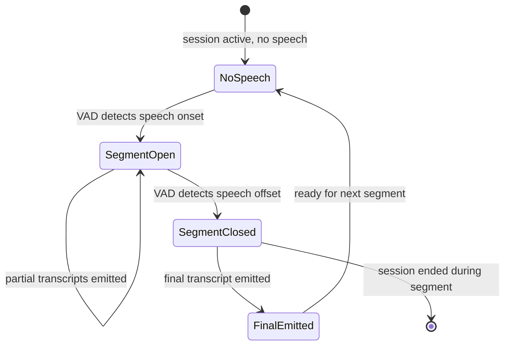

# Transcription API

## Overview

This document defines the semantics of transcription results delivered via the Realtime WebSocket API. It covers partial vs final transcripts, segment lifecycle, confidence scores, and client rendering behavior.

**Status:** Documented, not implemented.

## Transcript Types

### Partial Transcript

A partial transcript is an **interim result** emitted while speech is ongoing. It represents the best current transcription of the accumulated audio in the active VAD segment.

| Property | Value |
|----------|-------|
| Message type | `transcript.partial` |
| Stability | Unstable — may be revised by subsequent partials |
| UI behavior | Replace current partial display (do not append) |
| Frequency | Every 200–500 ms during active speech |
| Identified by | `segment_id` + `sequence` |

### Final Transcript

A final transcript is a **stable result** for a completed VAD speech segment. It will not be revised.

| Property | Value |
|----------|-------|
| Message type | `transcript.final` |
| Stability | Stable — will not change |
| UI behavior | Append to transcript history |
| Emitted | Once, when VAD segment closes |
| Identified by | `segment_id` (highest `sequence` for that segment) |

## Segment Lifecycle



### Example Flow

```
Time    Event                           UI Display
─────   ─────────────────────────────   ──────────────────────────
0.0s    VAD: speech onset (seg-001)     
0.3s    partial: "Hel"                  "Hel"
0.5s    partial: "Hello"                "Hello"
0.8s    partial: "Hello wor"            "Hello wor"
1.1s    partial: "Hello world"          "Hello world"
2.0s    VAD: speech offset (seg-001)    
2.1s    final: "Hello world"            "Hello world"          ← appended to history
2.5s    VAD: speech onset (seg-002)     
2.8s    partial: "how"                  "how"
3.1s    partial: "how are"              "how are"
3.5s    VAD: speech offset (seg-002)    
3.6s    final: "how are you"            "Hello world\nhow are you"  ← appended
```

## Transcript Fields

### Common Fields

| Field | Type | Description |
|-------|------|-------------|
| `segment_id` | string (UUID) | Unique identifier for the VAD speech segment |
| `sequence` | int | Monotonically increasing within a segment (starts at 1) |
| `text` | string | Transcription text (UTF-8) |
| `language` | string | BCP-47 language code |
| `confidence` | float | Model confidence score (0.0–1.0) |

### Final-Only Fields

| Field | Type | Description |
|-------|------|-------------|
| `start_ms` | int | Segment start time relative to session start (milliseconds) |
| `end_ms` | int | Segment end time relative to session start (milliseconds) |

## Client Rendering Guidelines

### Partial Transcript Display

```
┌─────────────────────────────────────┐
│ Transcript History (final)          │
│                                     │
│ Hello world                         │
│ how are you                         │
│                                     │
│ ─ ─ ─ ─ ─ ─ ─ ─ ─ ─ ─ ─ ─ ─ ─ ─ │
│ I'm doing we█                       │  ← partial (italic/dimmed)
└─────────────────────────────────────┘
```

- Display the latest partial for the current segment below the final history
- Replace (not append) on each new partial
- Visual distinction: italic, dimmed color, or cursor indicator
- Remove partial display when final transcript arrives

### Final Transcript Display

- Append to transcript history
- Remove the partial display for that segment
- Optionally show timestamps (from `start_ms` / `end_ms`)

### Handling Sequence Gaps

If the client receives `transcript.partial` with `sequence` N+2 but missed N+1:
- Display the received partial (latest is authoritative)
- Do not request retransmission of missed partials
- Log the gap for debugging

## Language Handling

| Scenario | Behavior |
|----------|----------|
| Client specifies `language: "en"` in `audio.start` | ASR uses English; `language` field in transcripts is `"en"` |
| Client omits language | Defaults to `"en"` |
| Future: auto-detect | `language` field reflects detected language; client may display language indicator |

## Confidence Scores

Confidence scores are model-dependent and may not be available from all ASR backends.

| Range | Interpretation |
|-------|---------------|
| 0.9–1.0 | High confidence |
| 0.7–0.9 | Moderate confidence |
| < 0.7 | Low confidence — consider visual indicator |

If the ASR backend does not provide confidence scores, the field is omitted from the payload.

## Empty Transcripts

| Scenario | Behavior |
|----------|----------|
| VAD detects speech but ASR returns empty | No partial/final emitted for that segment |
| Very short speech (< 250 ms) | VAD may filter out; no transcript emitted |
| Non-speech audio (noise, cough) | VAD may or may not trigger; ASR may return empty or garbage text |

## Multi-Segment Sessions

A single session may contain many speech segments. Each segment has its own `segment_id`. Final transcripts accumulate in the session's transcript history.

There is no session-level "full transcript" message. The client constructs the full transcript by concatenating final transcripts in order.

## Related Documents

- [Realtime WebSocket API](realtime-websocket.md)
- [Error Handling](error-handling.md)
- [Realtime Audio Pipeline](../architecture/realtime-audio.md)
