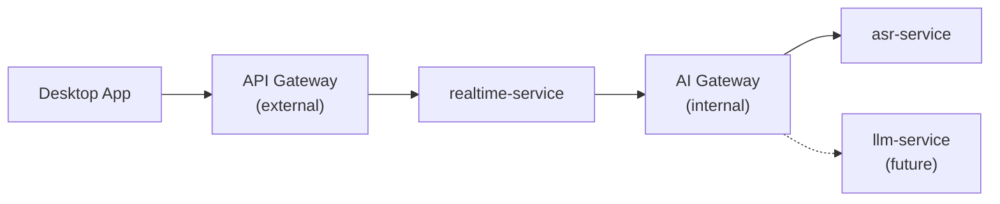
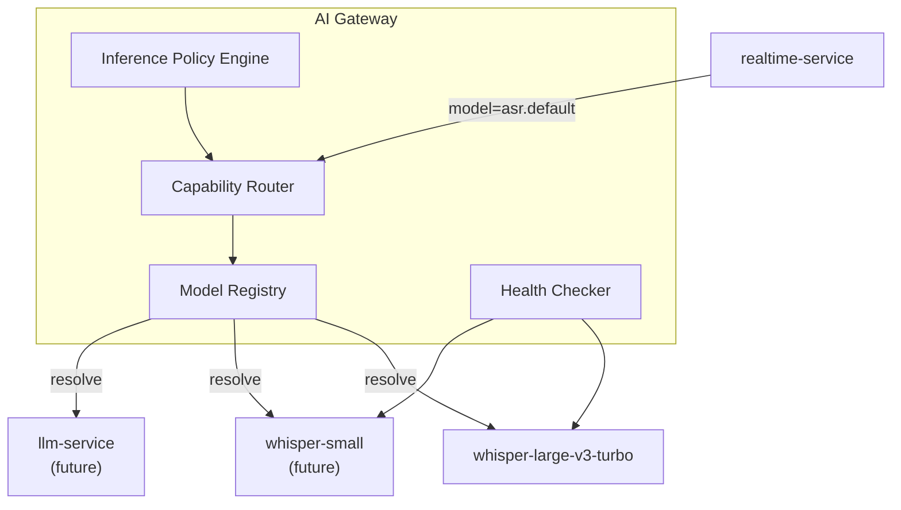
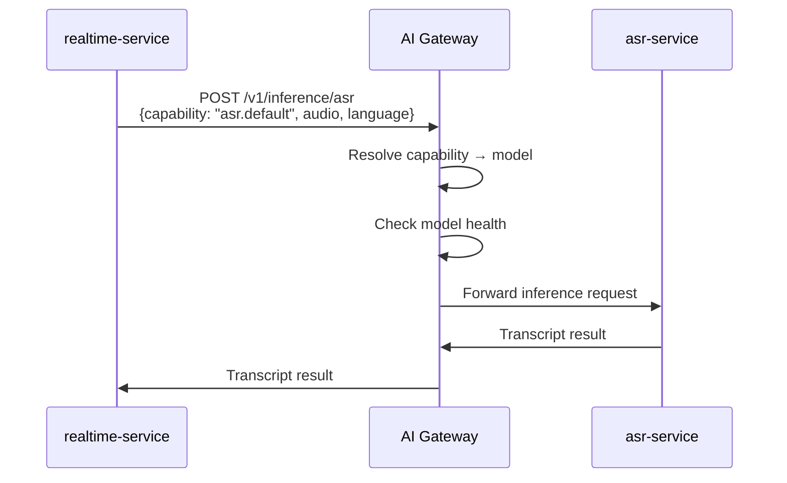
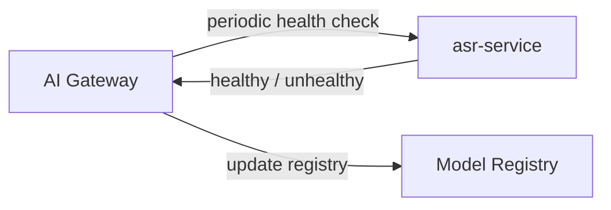
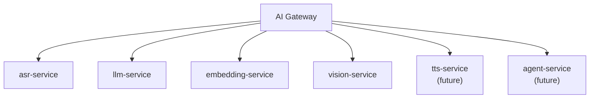

# AI Gateway

## Overview

The AI Gateway is an internal service that routes inference requests to model backends based on **capability aliases**. It decouples application logic from specific model implementations, enabling model swaps, versioning, fallback, and future multi-model support without changing client or realtime-service code.

The AI Gateway is **not** the external API Gateway. See distinction below.

## API Gateway vs AI Gateway



| | API Gateway | AI Gateway |
|---|------------|------------|
| **Audience** | External clients | Internal services |
| **Responsibilities** | Auth, rate limiting, TLS, routing, request validation | Model routing, versioning, health, fallback, capability resolution |
| **Protocol** | WebSocket, HTTP (external) | HTTP/gRPC (internal) |
| **Knows about models** | No | Yes |
| **Phase** | Phase 6 (AWS) | Phase 8 |

## Architecture



## Capability Aliases

Clients and the realtime-service reference models by capability alias, not by model name or endpoint.

| Alias | Resolves To (initial) | Future Alternatives |
|-------|----------------------|---------------------|
| `asr.default` | `whisper-large-v3-turbo` | — |
| `asr.fast` | — | `whisper-small`, `whisper-base` |
| `asr.accurate` | — | `whisper-large-v3` (non-turbo) |
| `asr.japanese` | — | Japanese-specialized ASR model |
| `llm.default` | — | Production LLM |
| `embedding.default` | — | Embedding model |
| `vision.default` | — | Vision model |

### Resolution Example

```
Request:  { "capability": "asr.default", "audio": <bytes>, "language": "en" }

AI Gateway resolves:
  asr.default → whisper-large-v3-turbo
  → route to asr-service pod
  → return transcript
```

If `asr.default` is later changed to a different model, no client or realtime-service code changes are required.

## Model Registry

The model registry maps capability aliases to model configurations:

```yaml
# Conceptual configuration — not implemented
models:
  whisper-large-v3-turbo:
    type: asr
    endpoint: http://asr-service:8080
    capabilities: [asr.default]
    version: "1.0"
    languages: [en]
    health_check_interval_s: 30

  whisper-small:
    type: asr
    endpoint: http://asr-service-fast:8080
    capabilities: [asr.fast]
    version: "1.0"
    languages: [en]
    health_check_interval_s: 30
```

Stored in ConfigMap (Kubernetes) or configuration file (local).

## Inference Request Flow



## Inference Policies

The policy engine controls routing behavior:

| Policy | Description | Phase |
|--------|-------------|-------|
| **Default routing** | Route to the model registered for the capability alias | Phase 8 |
| **Fallback** | If primary model is unhealthy, route to fallback model | Phase 8 |
| **Version pinning** | Route to a specific model version | Future |
| **Latency-based routing** | Route to fastest available model meeting quality threshold | Future |
| **Cost-based routing** | Route to cheapest model meeting quality threshold | Future |
| **Load balancing** | Distribute across multiple replicas of the same model | Phase 8 |

## Health Checking



| Check | Interval | Timeout | Failure Threshold |
|-------|----------|---------|-------------------|
| Model health | 30 s | 5 s | 3 consecutive failures → mark unhealthy |
| Recovery | 30 s | 5 s | 2 consecutive successes → mark healthy |

Unhealthy models are excluded from routing. If all models for a capability are unhealthy, the gateway returns a `503` error.

## API (Internal)

### POST `/v1/inference/asr`

```json
{
  "capability": "asr.default",
  "audio": "<base64-encoded PCM>",
  "language": "en",
  "segment_id": "seg-uuid",
  "is_final": false
}
```

Response:

```json
{
  "text": "Hello world",
  "segment_id": "seg-uuid",
  "is_final": false,
  "confidence": 0.95,
  "model": "whisper-large-v3-turbo",
  "latency_ms": 280
}
```

### GET `/v1/models`

List registered models and their health status.

### GET `/health`

AI Gateway health check.

## Future Model Types

The AI Gateway is designed to support additional model types through the same capability-routing pattern:



Each model type has its own inference endpoint pattern:

| Type | Endpoint | Capability Examples |
|------|----------|-------------------|
| ASR | `/v1/inference/asr` | `asr.default`, `asr.fast` |
| LLM | `/v1/inference/llm` | `llm.default`, `llm.fast` |
| Embedding | `/v1/inference/embedding` | `embedding.default` |
| Vision | `/v1/inference/vision` | `vision.default` |

## What the AI Gateway Does NOT Do

- Audio capture or processing
- VAD
- Session management
- Client authentication (handled by API Gateway)
- WebSocket management
- Transcript storage

## Phase Introduction

| Phase | AI Gateway State |
|-------|-----------------|
| Phase 1–7 | Not present; realtime-service calls ASR directly |
| Phase 8 | Introduced; realtime-service routes through AI Gateway |
| Phase 9+ | Multiple models registered; capability aliases expanded |

## Related Documents

- [ADR-008: AI Gateway](../decisions/ADR-008-ai-gateway.md)
- [Backend Architecture](backend.md)
- [Model Serving](model-serving.md)
- [Kubernetes Architecture](kubernetes.md)
