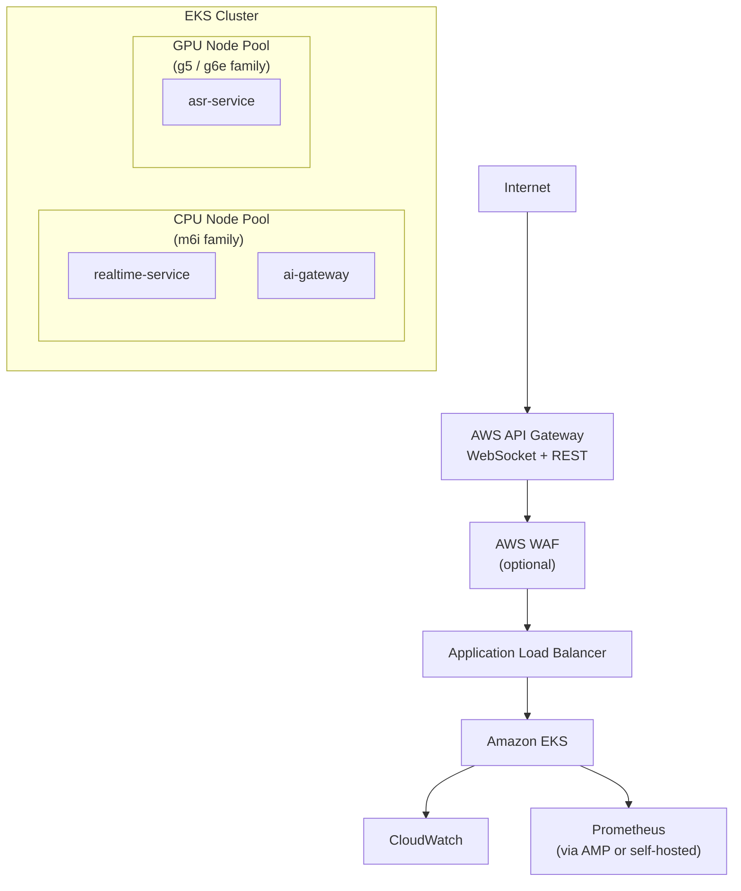
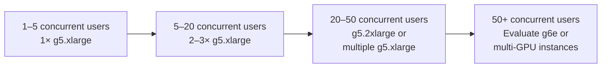
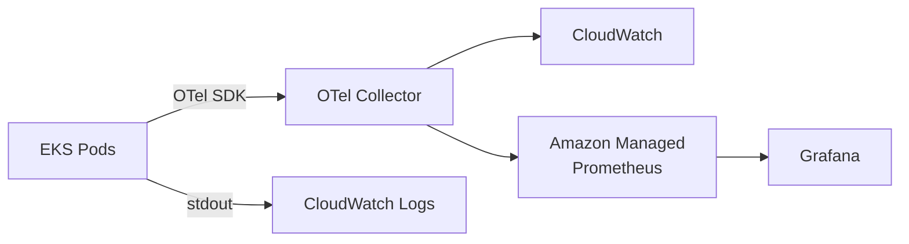

# AWS GPU Strategy

## Overview

This document describes the AWS infrastructure strategy for Voragon production deployment, focusing on GPU instance selection, scaling methodology, and cost planning. AWS pricing and instance specifications change over time; this document provides a planning framework, not permanent pricing facts.

## Production Architecture on AWS



## GPU Instance Recommendation

### Initial: G5 / NVIDIA A10G

| Property | g5.xlarge | g5.2xlarge | g5.4xlarge |
|----------|-----------|------------|------------|
| GPU | 1× NVIDIA A10G | 1× NVIDIA A10G | 1× NVIDIA A10G |
| GPU memory | 24 GB | 24 GB | 24 GB |
| vCPUs | 4 | 8 | 16 |
| System memory | 16 GB | 32 GB | 64 GB |
| Network | Up to 10 Gbps | Up to 10 Gbps | Up to 25 Gbps |
| EBS bandwidth | Up to 3.5 Gbps | Up to 3.5 Gbps | Up to 8 Gbps |

**Recommended initial instance: `g5.xlarge`**

Rationale:
- 24 GB GPU memory is sufficient for Whisper Large-v3 Turbo in float16 (~1.5 GB) with substantial headroom for concurrent sessions
- 4 vCPUs adequate for audio preprocessing and inference orchestration
- 16 GB system memory sufficient for model loading and Python runtime
- Lowest cost entry point in the G5 family for inference validation

### Suitability for Whisper Large-v3 Turbo

| Factor | Assessment |
|--------|------------|
| Model memory (float16) | ~1.5 GB — fits easily in 24 GB |
| Model memory (int8) | ~800 MB — even more headroom |
| Single-stream latency | Expected to meet < 300 ms inference target (not yet benchmarked) |
| Concurrent sessions (estimate) | 5–15 per g5.xlarge (depends on partial transcription frequency; not yet benchmarked) |
| Batch inference | Possible but adds latency; not recommended for realtime initially |

**Limitations of g5.xlarge:**
- Single GPU limits horizontal scaling to one inference pod per instance
- 4 vCPUs may bottleneck if running both ASR and preprocessing in the same pod
- 16 GB system memory is tight if loading multiple models (not a Phase 7 concern)

### Scaling Strategy



| Concurrent Sessions | Recommended Setup |
|--------------------|-------------------|
| 1–5 | 1× g5.xlarge |
| 5–20 | 2–3× g5.xlarge (HPA on GPU utilization) |
| 20–50 | g5.2xlarge or 4–6× g5.xlarge |
| 50+ | Evaluate g6e (L40S) or dedicated inference optimization |

GPU sizing is primarily determined by **concurrency, throughput, latency requirements, and batching** — not simply model size.

## Future Option: G6e / NVIDIA L40S

| Property | g6e.xlarge | g6e.2xlarge | g6e.4xlarge |
|----------|------------|-------------|-------------|
| GPU | 1× NVIDIA L40S | 1× NVIDIA L40S | 1× NVIDIA L40S |
| GPU memory | 48 GB | 48 GB | 48 GB |
| vCPUs | 4 | 8 | 16 |
| System memory | 32 GB | 64 GB | 128 GB |
| Network | Up to 20 Gbps | Up to 20 Gbps | Up to 40 Gbps |

**When to consider G6e:**
- Higher concurrent session counts (> 20 per instance)
- Running multiple models on the same GPU (ASR + LLM)
- Need for larger batch sizes
- LLM inference added (Phase 9+) requiring more GPU memory

G6e is not the initial target. Evaluate when concurrent session requirements exceed G5 capacity or when additional model types are deployed.

## CPU Instance Recommendation

| Service | Instance Type | vCPUs | Memory | Count |
|---------|--------------|-------|--------|-------|
| realtime-service | m6i.large | 2 | 8 GB | 2 (HPA) |
| ai-gateway | m6i.large | 2 | 8 GB | 2 (HPA) |

CPU instances do not require GPU resources. Scale based on WebSocket connection count and CPU utilization.

## Cost Planning Methodology

AWS pricing varies by region, purchasing model, and time. Do not treat any price cited here as current or permanent.

### Planning Steps

1. **Identify instance types** — g5.xlarge (GPU), m6i.large (CPU)
2. **Estimate utilization** — hours per day × expected concurrent sessions
3. **Check current pricing** — [AWS EC2 Pricing](https://aws.amazon.com/ec2/pricing/on-demand/), [AWS Pricing Calculator](https://calculator.aws/)
4. **Compare purchasing models**:

| Model | Description | Trade-off |
|-------|-------------|-----------|
| On-Demand | Pay per hour, no commitment | Highest cost, maximum flexibility |
| Reserved (1yr/3yr) | Commit to capacity | 30–60% savings, capacity risk |
| Spot | Bid on unused capacity | 60–90% savings, interruption risk |
| Savings Plans | Commit to $/hour spend | Flexible across instance types |

5. **Estimate monthly cost**:

```
monthly_cost = (gpu_instances × gpu_hourly_rate × hours_per_month)
             + (cpu_instances × cpu_hourly_rate × hours_per_month)
             + (eks_cluster_fee)
             + (alb_hours)
             + (data_transfer)
             + (ebs_storage)
             + (api_gateway_requests)
```

6. **Add observability costs** — CloudWatch, Prometheus (AMP), log storage

### Spot Instance Considerations for GPU

Spot instances offer significant savings but can be interrupted. For realtime inference:

| Approach | Suitability |
|----------|-------------|
| Spot for ASR pods with fallback | Moderate — interruption causes active session loss; client reconnects |
| On-Demand for ASR, Spot for batch | Better — realtime on stable instances |
| Mixed node pool (Spot + On-Demand) | Recommended for cost optimization at scale |

For initial deployment, use On-Demand instances. Introduce Spot when session recovery is proven reliable.

## AWS Services Used

| Service | Purpose | Phase |
|---------|---------|-------|
| EKS | Container orchestration | Phase 6 |
| EC2 (G5/G6e) | GPU inference nodes | Phase 7 |
| EC2 (M6i) | CPU service nodes | Phase 6 |
| ALB | WebSocket ingress, TLS termination | Phase 6 |
| API Gateway | External API entry, auth, rate limiting | Phase 6 |
| ECR | Container image registry | Phase 4 |
| Secrets Manager | Secrets storage | Phase 6 |
| CloudWatch | Logs, basic metrics | Phase 6 |
| S3 | Model artifact storage (optional) | Phase 7 |

## Observability on AWS



| Signal | AWS Service | Alternative |
|--------|------------|-------------|
| Metrics | Amazon Managed Prometheus | Self-hosted Prometheus on EKS |
| Logs | CloudWatch Logs | Self-hosted Loki |
| Traces | AWS X-Ray (via OTel) | Jaeger on EKS |
| Dashboards | Grafana (self-hosted or managed) | CloudWatch Dashboards |
| Alerts | CloudWatch Alarms | Prometheus Alertmanager |

## Region Selection

Choose a region based on:
- Proximity to primary users (latency)
- G5/G6e instance availability
- Current pricing (varies by region)
- Data residency requirements (future)

Document the chosen region in deployment configuration when selected. No region is prescribed here.

## Related Documents

- [ADR-009: Kubernetes / EKS](../decisions/ADR-009-kubernetes-eks.md)
- [ADR-010: GPU Node Pool](../decisions/ADR-010-gpu-node-pool.md)
- [Kubernetes Architecture](kubernetes.md)
- [Model Serving](model-serving.md)
- [Operations: AWS Deployment](../operations/aws-deployment.md)
- [Operations: Observability](../operations/observability.md)
