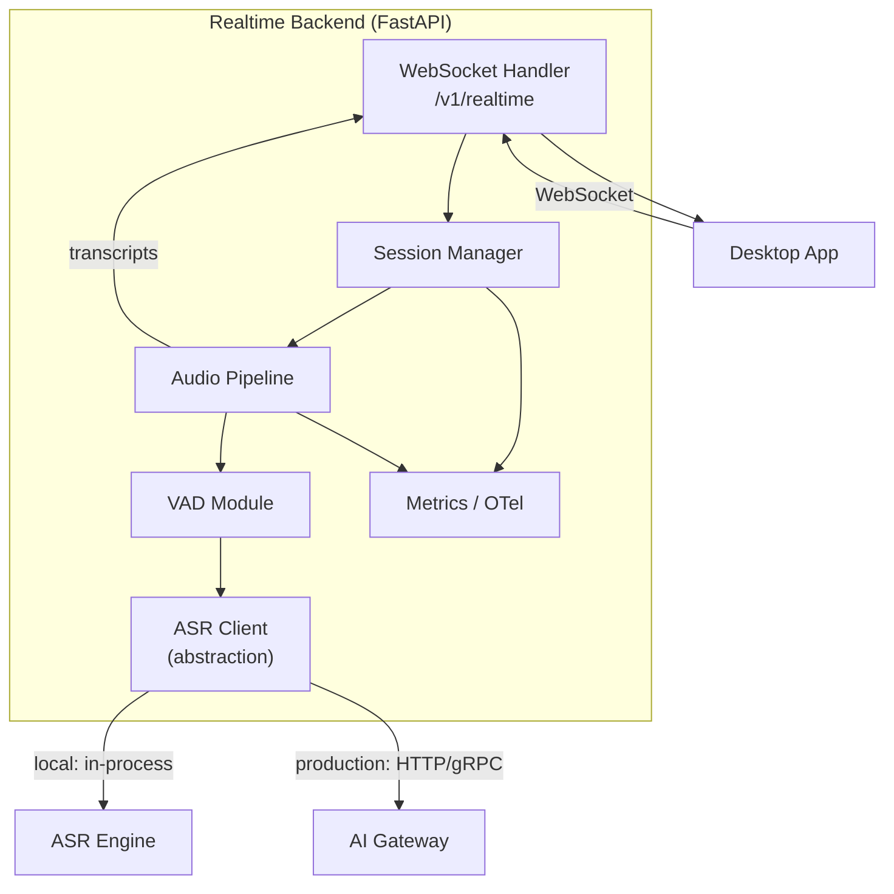
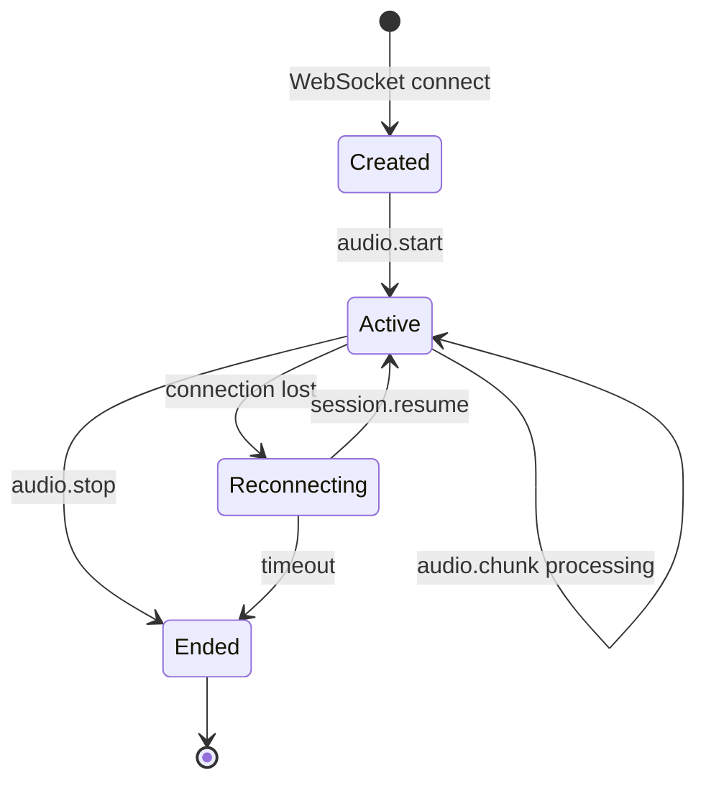
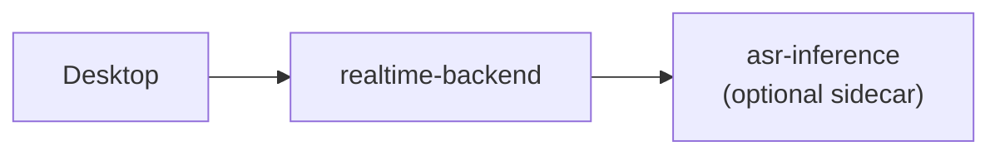
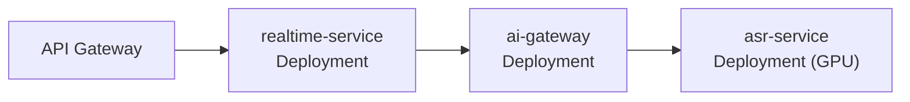

# Backend Architecture

## Overview

The Realtime Backend is a Python **FastAPI** service that manages WebSocket sessions, orchestrates the audio pipeline (receive → VAD → ASR), and delivers transcripts to connected clients. It does not load model weights directly in the MVP; inference is delegated to an ASR abstraction layer that can be in-process or a separate service.

## Architecture



## Responsibilities

| Responsibility | Owner |
|---------------|-------|
| WebSocket connection management | Realtime Backend |
| Session lifecycle (create, resume, end) | Realtime Backend |
| Audio frame reception and buffering | Realtime Backend |
| VAD (voice activity detection) | Realtime Backend |
| ASR inference invocation | ASR abstraction (in-process or via AI Gateway) |
| Transcript delivery (partial/final) | Realtime Backend |
| Authentication (production) | API Gateway (upstream) |
| Model selection | AI Gateway (production) or config (local) |

## Service Structure (Planned)

```
backend/
├── app/
│   ├── main.py                 # FastAPI app entry
│   ├── config.py               # Settings (pydantic-settings)
│   ├── websocket/
│   │   ├── handler.py          # WebSocket endpoint
│   │   ├── messages.py         # Message types and serialization
│   │   └── session.py          # Session state management
│   ├── pipeline/
│   │   ├── audio_buffer.py     # Per-session ring buffer
│   │   ├── vad.py              # VAD abstraction
│   │   └── orchestrator.py     # Pipeline coordination
│   ├── asr/
│   │   ├── base.py             # ASR interface (abstract)
│   │   ├── whisper_cpp.py      # whisper.cpp adapter
│   │   └── faster_whisper.py   # faster-whisper adapter
│   ├── gateway/
│   │   └── client.py           # AI Gateway HTTP client (production)
│   └── observability/
│       ├── metrics.py          # Prometheus metrics
│       └── tracing.py          # OpenTelemetry setup
├── tests/
├── pyproject.toml
└── Dockerfile                  # (Phase 4)
```

**P1-001 implemented:** `app/main.py`, `app/config.py`, `tests/`.
**P1-002 implemented:** `app/websocket/handler.py`, `messages.py`, `session.py` — WebSocket `/v1/realtime` and `session.started`.
**P1-003 implemented:** `app/pipeline/audio_buffer.py`, `app/websocket/audio_frame.py` — `audio.start` and binary `audio.chunk` reception with per-session ring buffer.
**P1-004 implemented:** `app/pipeline/vad.py`, `silero_vad.py`, `segment_tracker.py` — Silero VAD per-frame processing and speech segment tracking.
Remaining modules are planned for later dev-steps.

## ASR Abstraction

The backend does not depend on a specific ASR implementation. All inference goes through an abstract interface:

```python
# Conceptual interface — not implemented
class ASREngine(Protocol):
    async def transcribe_partial(
        self, audio: bytes, segment_id: str, language: str
    ) -> TranscriptResult: ...

    async def transcribe_final(
        self, audio: bytes, segment_id: str, language: str
    ) -> TranscriptResult: ...

    async def health(self) -> HealthStatus: ...
```

Implementations:

| Adapter | Use Case | Phase |
|---------|----------|-------|
| `faster_whisper` | Local dev on NVIDIA GPU / CPU | Phase 1 |
| `whisper_cpp` | Local dev on Apple Silicon | Phase 1 |
| `gateway` | Production via AI Gateway | Phase 7–8 |

The active adapter is selected via configuration (`ASR_BACKEND=faster_whisper|whisper_cpp|gateway`).

See [Model Serving](model-serving.md) for implementation trade-offs.

## Session Management



### Session State

Each session maintains:

| Field | Type | Description |
|-------|------|-------------|
| `session_id` | UUID | Unique session identifier |
| `created_at` | timestamp | Session creation time |
| `language` | string | BCP-47 language code (default: `en`) |
| `model` | string | Capability alias (e.g., `asr.default`) |
| `audio_buffer` | ring buffer | Accumulated audio frames |
| `segments` | list | Active and completed VAD segments |
| `sequence` | int | Monotonic sequence counter |

### Concurrency Model

- Each WebSocket connection maps to one session.
- Audio frame processing is async per session (asyncio).
- VAD and ASR calls are awaited; multiple sessions run concurrently on the same event loop.
- For CPU-bound ASR inference, a thread pool or process pool executor is used to avoid blocking the event loop.

## API Surface

### External (Desktop → Backend)

| Endpoint | Protocol | Description |
|----------|----------|-------------|
| `/v1/realtime` | WebSocket | Realtime audio streaming and transcript delivery |
| `/health` | HTTP GET | Health check |
| `/metrics` | HTTP GET | Prometheus metrics (internal) |

### Internal (Backend → AI Gateway, Production)

| Endpoint | Protocol | Description |
|----------|----------|-------------|
| `/v1/inference/asr` | HTTP POST | ASR inference request |
| `/health` | HTTP GET | AI Gateway health |

See [Realtime WebSocket API](../api/realtime-websocket.md) and [AI Gateway](ai-gateway.md) for protocol details.

## Configuration

| Variable | Default | Description |
|----------|---------|-------------|
| `HOST` | `0.0.0.0` | Bind address |
| `PORT` | `8000` | Bind port |
| `ASR_BACKEND` | `faster_whisper` | ASR adapter selection |
| `ASR_MODEL` | `large-v3-turbo` | Model identifier |
| `VAD_BACKEND` | `silero` | VAD implementation |
| `AI_GATEWAY_URL` | — | AI Gateway URL (production only) |
| `SESSION_TIMEOUT_S` | `300` | Max idle session duration |
| `RECONNECT_WINDOW_S` | `30` | Session state retention after disconnect |
| `LOG_LEVEL` | `info` | Logging level |
| `OTEL_EXPORTER_ENDPOINT` | — | OpenTelemetry collector endpoint |

## Error Handling

Errors are delivered to the client as `error` WebSocket messages. The backend does not crash on single-session errors.

| Error Category | Behavior |
|---------------|----------|
| Invalid message format | Send `error`, continue session |
| ASR inference failure | Send `error`, retry once, then skip segment |
| VAD failure | Send `error`, pass all audio to ASR (degraded mode) |
| Session timeout | Send `session.ended`, close connection |
| Unrecoverable error | Send `error` + `session.ended`, close connection |

See [Error Handling](../api/error-handling.md) for error codes and client recovery behavior.

## Observability

| Signal | Tool | Phase |
|--------|------|-------|
| Request/session metrics | Prometheus | Phase 2 |
| Distributed tracing | OpenTelemetry | Phase 2 |
| Structured logging | JSON logs to stdout | Phase 1 |
| Health checks | `/health` endpoint | Phase 1 |

Key metrics:

- `voragon_sessions_active` — current active sessions
- `voragon_audio_frames_received` — frames received per session
- `voragon_audio_frames_dropped` — frames dropped due to buffer overflow
- `voragon_vad_segments` — VAD segments detected
- `voragon_asr_inference_duration_seconds` — ASR inference latency histogram
- `voragon_transcript_partial_total` — partial transcripts emitted
- `voragon_transcript_final_total` — final transcripts emitted
- `voragon_ws_connections` — active WebSocket connections

## Deployment Modes

### Local Development (Phase 1)

Single process. ASR adapter runs in-process. No AI Gateway.

```
python -m app.main
```

### Docker Compose (Phase 4)



Backend and ASR may be separate containers if the inference engine benefits from isolation (e.g., GPU container).

### Kubernetes (Phase 5–6)



See [Kubernetes Architecture](kubernetes.md) for details.

## Security

| Concern | Local | Production |
|---------|-------|------------|
| Authentication | None (localhost) | JWT via API Gateway |
| TLS | None (localhost) | TLS termination at API Gateway |
| Rate limiting | None | API Gateway |
| Input validation | Message schema validation | Message schema validation |
| Secrets | Environment variables | Kubernetes Secrets / AWS Secrets Manager |

## Related Documents

- [ADR-003: Python + FastAPI Backend](../decisions/ADR-003-python-fastapi-backend.md)
- [ADR-004: WebSocket for Realtime Communication](../decisions/ADR-004-realtime-websocket.md)
- [ADR-007: Separate Desktop and Backend](../decisions/ADR-007-separate-desktop-backend.md)
- [Realtime Audio Pipeline](realtime-audio.md)
- [Model Serving](model-serving.md)
- [AI Gateway](ai-gateway.md)
- [Realtime WebSocket API](../api/realtime-websocket.md)
