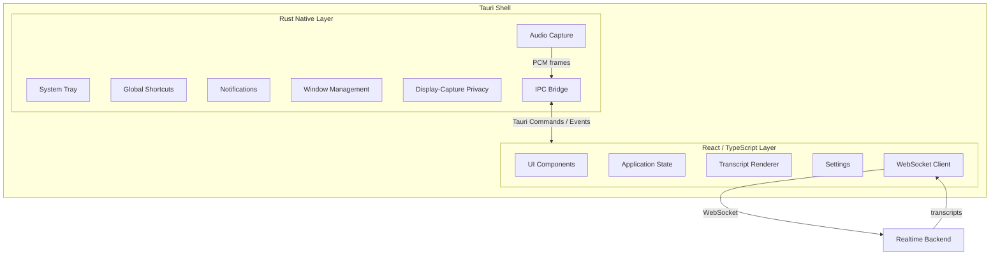
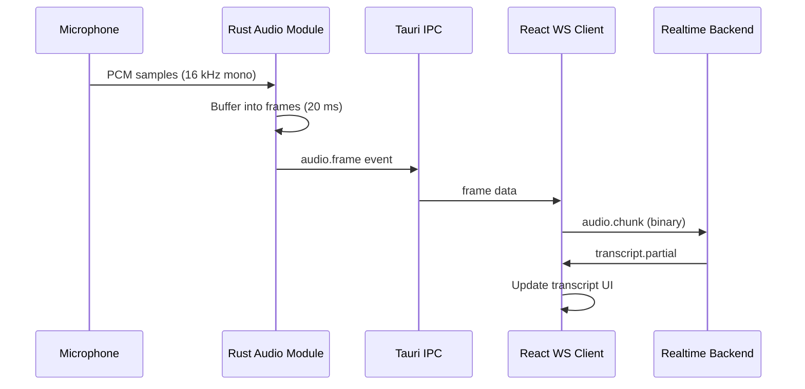

# Desktop Architecture

## Overview

The Voragon desktop application is a cross-platform, local-first client built with **Tauri 2**, **Rust**, **React**, and **TypeScript**. It is intentionally lightweight: it captures audio, communicates with the Realtime Backend over WebSocket, and renders transcripts. It does not contain AI inference logic.

## Architecture



## Layer Responsibilities

### React / TypeScript

| Responsibility | Details |
|---------------|---------|
| UI rendering | Transcript display, connection status, settings panels |
| Application state | Session state, transcript history, user preferences |
| WebSocket client | Connect, send audio frames, receive transcript events |
| Settings | Backend URL, audio device selection, model preference (capability alias) |
| Error display | Connection errors, permission errors, backend errors |

React/TypeScript does **not**:

- Access the microphone directly (delegates to Rust)
- Perform audio encoding/decoding beyond passing frames received from Rust
- Load or invoke AI models
- Manage OS-level permissions beyond triggering Rust commands

### Rust Native Layer

| Responsibility | Details |
|---------------|---------|
| Audio capture | Microphone enumeration, PCM capture, frame buffering |
| System tray | Background presence, quick actions |
| Global shortcuts | Start/stop transcription hotkeys |
| Notifications | Transcription status, errors |
| Window management | Minimize-to-tray, always-on-top (future) |
| Display-capture privacy | OS-supported window exclusion from screen capture (future) |
| IPC bridge | Expose audio frames and native capabilities to the frontend via Tauri commands/events |
| Process management | Backend process lifecycle (optional local launcher in later phases) |

Rust does **not**:

- Run ASR inference
- Implement VAD
- Parse or modify transcript content

## Audio Capture Flow



Audio capture parameters are defined in [Realtime Audio Pipeline](realtime-audio.md). The desktop sends frames; it does not decide when speech starts or ends.

## Platform Support

| Platform | Status | Notes |
|----------|--------|-------|
| macOS | Initial target | Primary development platform; Apple Silicon optimization path via whisper.cpp |
| Windows | Initial target | Secondary development platform |
| Linux | Future | Not in initial scope; Tauri supports it when needed |

## Platform-Specific Considerations

### macOS

- Microphone permission via `NSMicrophoneUsageDescription` in `Info.plist`
- System tray via Tauri tray API
- Global shortcuts via Tauri global-shortcut plugin
- Display-capture privacy: `NSWindow.sharingType = .none` (macOS 15+) or equivalent; see [ADR-011](../decisions/ADR-011-privacy-display-capture.md)
- Audio capture via `cpal` or platform-native APIs through Tauri plugins

### Windows

- Microphone permission via Windows privacy settings (no explicit prompt in all cases; app must handle denial gracefully)
- System tray via Tauri tray API
- Global shortcuts via Tauri global-shortcut plugin
- Display-capture privacy: `WDA_EXCLUDEFROMCAPTURE` display affinity (Windows 10 2004+); see [ADR-011](../decisions/ADR-011-privacy-display-capture.md)
- Audio capture via WASAPI through `cpal`

## Application Structure (Planned)

```
desktop/
├── src/                    # React / TypeScript frontend
│   ├── components/         # UI components
│   ├── hooks/              # React hooks (useWebSocket, useTranscript)
│   ├── state/              # Application state management
│   ├── api/                # WebSocket client, message serialization
│   └── settings/           # User preferences
├── src-tauri/              # Rust native layer
│   ├── src/
│   │   ├── audio/          # Audio capture and buffering
│   │   ├── tray/           # System tray
│   │   ├── shortcuts/      # Global shortcuts
│   │   ├── privacy/        # Display-capture privacy
│   │   └── lib.rs          # Tauri app entry, command registration
│   └── tauri.conf.json
├── package.json
└── Cargo.toml
```

This structure is planned, not implemented.

## Connection to Backend

The desktop connects to the Realtime Backend via WebSocket:

| Environment | URL |
|-------------|-----|
| Local development | `ws://localhost:8000/v1/realtime` |
| Production | `wss://api.voragon.example/v1/realtime` |

The desktop does not know which ASR model or inference backend is in use. It sends audio and receives transcripts. Model selection is a backend concern (resolved via AI Gateway in production).

See [Realtime WebSocket API](../api/realtime-websocket.md) for the full protocol.

## Security and Privacy (Desktop)

| Concern | Approach |
|---------|----------|
| Microphone access | Requested at runtime; denied state handled gracefully |
| Audio data in transit | TLS (wss://) in production; localhost in development |
| Audio data at rest | Not persisted by default; optional local transcript history (user-controlled) |
| Backend URL | Configurable; defaults to localhost |
| Credentials | Stored in OS keychain via Tauri secure storage (production) |
| Logging | No audio content in logs; transcript logging is opt-in |

## Resource Targets

| Metric | Target |
|--------|--------|
| Install size | < 50 MB (excluding backend) |
| Memory (idle) | < 80 MB |
| Memory (active) | < 150 MB |
| CPU (active transcription) | < 15% (audio capture + UI only) |

These are engineering targets, not measured values.

## Future Native Capabilities

The Rust layer is the extension point for OS-level features:

| Feature | Phase | Platform |
|---------|-------|----------|
| System tray | Phase 3 | macOS, Windows |
| Global shortcuts | Phase 3 | macOS, Windows |
| Native notifications | Phase 3 | macOS, Windows |
| Display-capture privacy | Phase 3+ | macOS, Windows |
| Local backend launcher | Phase 4 | macOS, Windows |
| Native inference (on-device) | Future | Platform-dependent |

Native on-device inference is a future option isolated behind the Rust layer and would communicate with the same backend API contract, not replace it initially.

## Related Documents

- [ADR-001: Tauri + React + TypeScript](../decisions/ADR-001-tauri-react-typescript.md)
- [ADR-002: Rust Native Layer](../decisions/ADR-002-rust-native-layer.md)
- [ADR-007: Separate Desktop and Backend](../decisions/ADR-007-separate-desktop-backend.md)
- [ADR-011: Privacy / Display-Capture](../decisions/ADR-011-privacy-display-capture.md)
- [Realtime Audio Pipeline](realtime-audio.md)
- [Realtime WebSocket API](../api/realtime-websocket.md)
