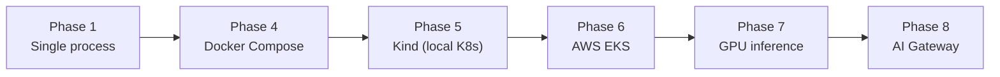
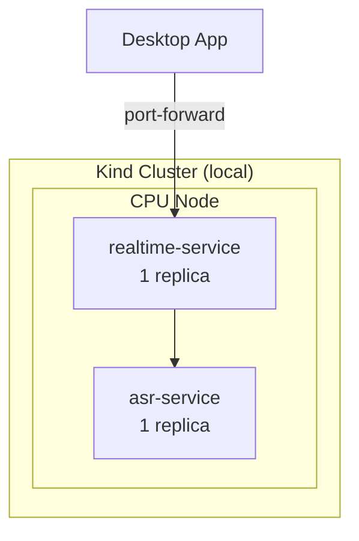
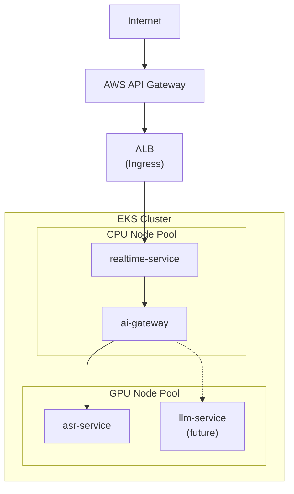
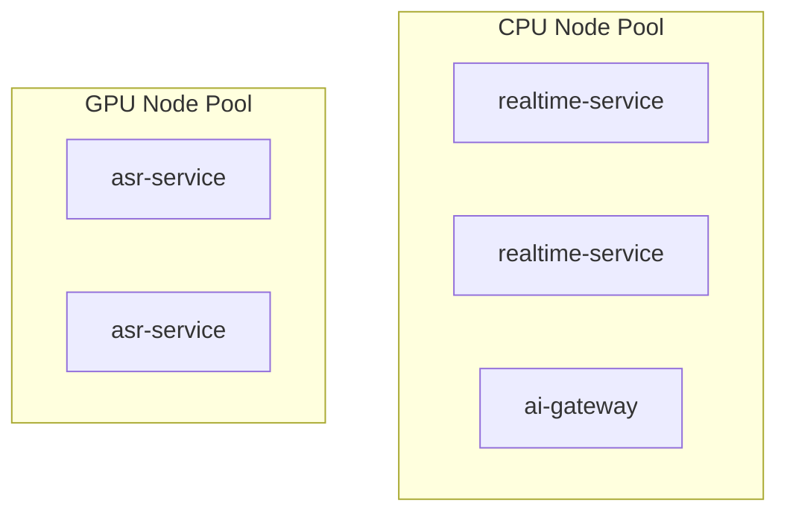
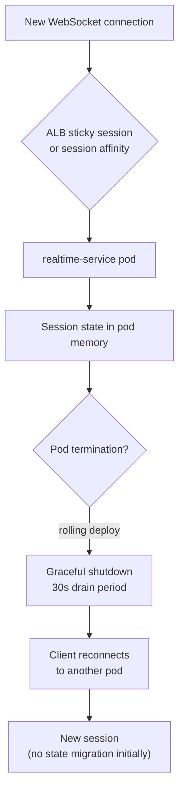
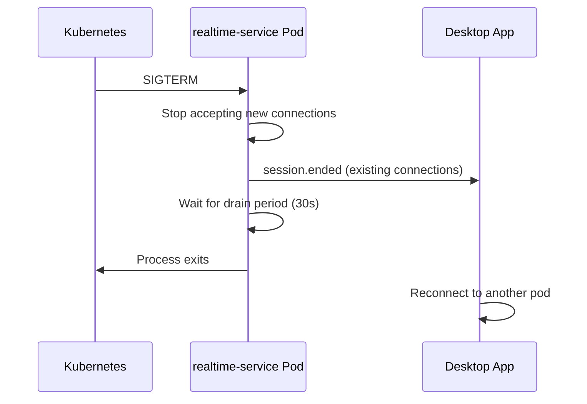
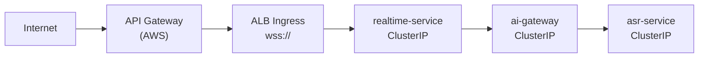

# Kubernetes Architecture

## Overview

This document describes the Kubernetes deployment architecture for Voragon, distinguishing between the **MVP Kubernetes setup** (local Kind cluster) and the **future production architecture** (AWS EKS). The initial system does not require Kubernetes; it is introduced when multi-container orchestration provides operational value.

## Architecture Evolution



## MVP Kubernetes Architecture (Phase 5 — Kind)

A minimal local Kubernetes cluster for validating deployment patterns before AWS.



| Component | Replicas | Node | GPU |
|-----------|----------|------|-----|
| realtime-service | 1 | CPU | No |
| asr-service | 1 | CPU | No (CPU inference for validation) |

Purpose: validate container images, health probes, ConfigMaps, service discovery, and deployment workflows. Not for performance testing.

## Production Architecture (Phase 6–8 — AWS EKS)



### Services

| Service | Type | Port | Node Pool | Phase |
|---------|------|------|-----------|-------|
| realtime-service | ClusterIP + Ingress | 8000 | CPU | Phase 6 |
| ai-gateway | ClusterIP | 8080 | CPU | Phase 8 |
| asr-service | ClusterIP | 8081 | GPU | Phase 7 |
| llm-service | ClusterIP | 8082 | GPU | Future |
| embedding-service | ClusterIP | 8083 | GPU/CPU | Future |
| session-service | ClusterIP | 8084 | CPU | Future |

### Node Pools



| Pool | Instance Type (example) | Purpose | Scaling |
|------|------------------------|---------|---------|
| CPU | m6i.large / m6i.xlarge | realtime-service, ai-gateway | HPA on CPU / connection count |
| GPU | g5.xlarge | asr-service | HPA on GPU utilization / queue depth |

#### CPU Node Pool

- Runs stateless realtime and gateway pods
- Scales horizontally based on WebSocket connection count and CPU utilization
- No GPU resources

#### GPU Node Pool

- Runs inference pods only
- NVIDIA device plugin required
- Node selector: `node-type=gpu`
- Taint: `nvidia.com/gpu=true:NoSchedule`
- Toleration on GPU pod spec

```yaml
# Conceptual pod spec — not implemented
nodeSelector:
  node-type: gpu
tolerations:
  - key: nvidia.com/gpu
    operator: Equal
    value: "true"
    effect: NoSchedule
resources:
  limits:
    nvidia.com/gpu: 1
  requests:
    nvidia.com/gpu: 1
    memory: 8Gi
    cpu: 2
```

## Kubernetes Resources

### Deployments

| Deployment | Replicas (initial) | Strategy |
|------------|-------------------|----------|
| realtime-service | 2 | RollingUpdate, maxUnavailable: 0 |
| ai-gateway | 2 | RollingUpdate, maxUnavailable: 0 |
| asr-service | 1–2 | RollingUpdate, maxUnavailable: 0 |

### ConfigMaps

| ConfigMap | Contents |
|-----------|----------|
| realtime-config | Session timeout, VAD parameters, log level |
| ai-gateway-config | Model registry, capability aliases, routing policies |
| asr-config | Model name, quantization, language defaults |

### Secrets

| Secret | Contents |
|--------|----------|
| api-jwt-keys | JWT signing keys for API Gateway auth |
| model-registry-auth | Credentials for model artifact storage (if applicable) |

Secrets are managed via AWS Secrets Manager with External Secrets Operator, or directly as Kubernetes Secrets for MVP.

## Health Probes

| Service | Liveness | Readiness |
|---------|----------|-----------|
| realtime-service | HTTP GET `/health` (30s interval) | HTTP GET `/health` (10s interval) |
| ai-gateway | HTTP GET `/health` (30s interval) | HTTP GET `/health` + model registry check (10s interval) |
| asr-service | HTTP GET `/health` (30s interval) | HTTP GET `/health` + model loaded check (15s interval) |

ASR readiness probe must verify the model is loaded and warmup is complete before accepting traffic.

## Horizontal Pod Autoscaling

| Service | Metric | Target | Min | Max |
|---------|--------|--------|-----|-----|
| realtime-service | CPU utilization | 70% | 2 | 10 |
| realtime-service | Active connections (custom) | 80 per pod | 2 | 10 |
| ai-gateway | CPU utilization | 70% | 2 | 5 |
| asr-service | GPU utilization | 70% | 1 | 4 |
| asr-service | Inference queue depth (custom) | 10 per pod | 1 | 4 |

Custom metrics require Prometheus Adapter or KEDA. Initial MVP uses CPU-based HPA only.

## WebSocket Scaling Challenges

Long-lived WebSocket connections create scaling challenges distinct from typical HTTP services.

### Challenges

| Challenge | Description |
|-----------|-------------|
| Sticky sessions | WebSocket connections must route to the same pod for the session duration |
| Connection draining | Rolling deployments must gracefully close or migrate active connections |
| Connection count limits | Each pod has a finite connection capacity |
| GPU session affinity | Inference requests from a session should ideally hit the same GPU pod (for caching) |

### Strategies



| Strategy | Phase | Details |
|----------|-------|---------|
| ALB sticky sessions | Phase 6 | Cookie-based session affinity at load balancer |
| Graceful shutdown | Phase 6 | `preStop` hook: stop accepting new connections, drain for 30s |
| Client reconnect | Phase 2 | Client handles reconnect; server does not migrate session state across pods initially |
| External session store | Future | Redis or similar for cross-pod session state (only if concrete requirement emerges) |

**Redis is not introduced initially.** Session state lives in the realtime-service pod memory. If a pod is terminated, clients reconnect and start a new session. This is acceptable for the MVP.

## Rolling Deployments

```yaml
# Conceptual deployment strategy — not implemented
strategy:
  type: RollingUpdate
  rollingUpdate:
    maxSurge: 1
    maxUnavailable: 0
```

| Concern | Approach |
|---------|----------|
| Zero-downtime deploys | maxUnavailable: 0; new pod must pass readiness before old pod terminates |
| WebSocket drain | preStop lifecycle hook with 30s sleep |
| Model reload | ASR pods: new pod loads model during startup; readiness probe gates traffic |
| Config changes | ConfigMap changes trigger rolling restart via Reloader or manual |

## Graceful Shutdown



1. Kubernetes sends SIGTERM
2. Pod stops accepting new WebSocket connections
3. Existing connections receive `session.ended` after current audio processing completes
4. Pod waits for drain period (30s default)
5. Pod exits; Kubernetes removes it from service endpoints

## NVIDIA Device Plugin

Required for GPU node pool:

- Install NVIDIA device plugin via Helm or manifest
- Verify with: `kubectl describe node <gpu-node> | grep nvidia.com/gpu`
- GPU resource requests in pod spec: `nvidia.com/gpu: 1`

## Networking



- External traffic enters via AWS API Gateway → ALB Ingress
- Internal service-to-service communication via ClusterIP (no external exposure)
- ASR service is never exposed externally
- Network policies (future): restrict GPU pods to only accept traffic from ai-gateway

## What Is NOT in the Initial Kubernetes Deployment

| Component | Reason |
|-----------|--------|
| Service mesh | Unnecessary for initial scale |
| Redis / external session store | No concrete cross-pod session requirement yet |
| KEDA | CPU HPA is sufficient initially |
| Multi-region | Single-region MVP |
| Custom operators | Standard Deployments and Services |
| GPU sharing (MIG, time-slicing) | One session per GPU initially |

## Related Documents

- [ADR-009: Kubernetes / EKS](../decisions/ADR-009-kubernetes-eks.md)
- [ADR-010: GPU Node Pool](../decisions/ADR-010-gpu-node-pool.md)
- [AWS GPU Strategy](aws.md)
- [AI Gateway](ai-gateway.md)
- [Operations: Kubernetes Local](../operations/kubernetes-local.md)
- [Operations: AWS Deployment](../operations/aws-deployment.md)
