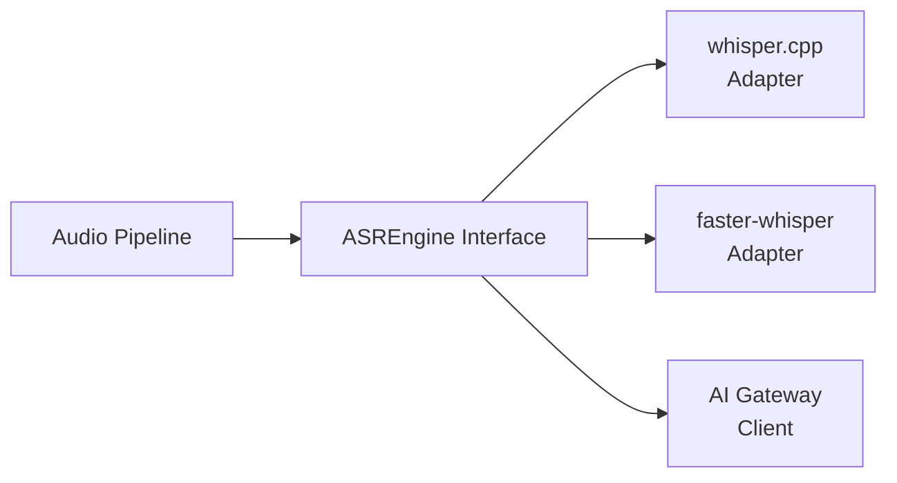
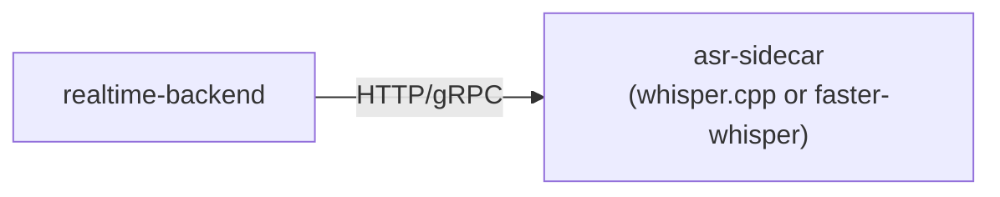
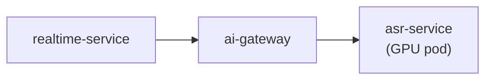

# Model Serving

## Overview

This document evaluates ASR inference backends for Voragon, defines the abstraction interface, and documents the trade-offs between candidate implementations. The architecture treats ASR as a replaceable component behind a model-agnostic interface.

## ASR Abstraction

All ASR inference flows through an abstract interface regardless of the underlying engine:



```python
# Conceptual interface — not implemented
class ASREngine(Protocol):
    async def transcribe_partial(
        self,
        audio: bytes,
        segment_id: str,
        language: str = "en",
    ) -> TranscriptResult:
        """Return interim transcription for ongoing speech."""
        ...

    async def transcribe_final(
        self,
        audio: bytes,
        segment_id: str,
        language: str = "en",
    ) -> TranscriptResult:
        """Return final transcription for a completed speech segment."""
        ...

    async def health(self) -> HealthStatus:
        """Report engine health and model load status."""
        ...

    async def warmup(self) -> None:
        """Pre-load model weights and run a dummy inference."""
        ...
```

The active adapter is selected at startup via configuration. The desktop application and WebSocket API are unaffected by which adapter is active.

## Initial Model: Whisper Large-v3 Turbo

| Property | Value |
|----------|-------|
| Model | `openai/whisper-large-v3-turbo` |
| Parameters | ~809M |
| Languages | Multilingual (English primary for Voragon) |
| Architecture | Encoder-decoder transformer |
| Input | 16 kHz mono PCM, 30-second chunks |
| Output | Text transcription |

Whisper Large-v3 Turbo is a distilled variant of Whisper Large-v3, optimized for speed with minimal accuracy loss. It is the recommended initial model. See [ADR-005](../decisions/ADR-005-whisper-large-v3-turbo.md).

## Candidate Implementations

### whisper.cpp

| Property | Details |
|----------|---------|
| Language | C/C++ |
| Python binding | `pywhispercpp` or subprocess |
| GPU support | Metal (Apple Silicon), CUDA, Vulkan, OpenCL |
| Quantization | GGML/GGUF formats (Q4, Q5, Q8, F16) |
| Streaming | Supported via incremental decoding |
| License | MIT |

**Strengths:**
- Excellent Apple Silicon performance via Metal backend
- Low memory footprint with quantization (Q5 ~500 MB)
- No Python runtime dependency for inference
- Active community; widely deployed
- Can run as standalone binary (sidecar pattern)

**Weaknesses:**
- Python integration requires bindings or subprocess overhead
- CUDA performance is good but not always competitive with faster-whisper
- Partial/streaming transcription API is less mature than faster-whisper
- Model conversion to GGUF format required

**Recommended for:** Local development on Apple Silicon (macOS).

### faster-whisper

| Property | Details |
|----------|---------|
| Language | Python (CTranslate2 backend) |
| GPU support | CUDA (NVIDIA) |
| CPU support | Yes (AVX2/AVX512) |
| Quantization | int8, float16, float32 |
| Streaming | Supported via `transcribe()` with `vad_filter` |
| License | MIT |

**Strengths:**
- Native Python integration (fits FastAPI backend naturally)
- Excellent NVIDIA GPU performance via CTranslate2
- Built-in VAD filter option (Silero)
- Well-documented streaming/partial transcription API
- float16 on GPU: good balance of speed and accuracy

**Weaknesses:**
- No Metal/Apple Silicon GPU support
- Higher memory usage than quantized whisper.cpp
- CPU-only inference is significantly slower than GPU
- CTranslate2 dependency adds build complexity

**Recommended for:** Local development on NVIDIA GPU; cloud GPU deployment (AWS G5/G6e).

### Comparison

| Criteria | whisper.cpp | faster-whisper |
|----------|-------------|----------------|
| Apple Silicon (M-series) | **Excellent** (Metal) | Poor (CPU only) |
| NVIDIA GPU (CUDA) | Good | **Excellent** |
| CPU-only | Good (quantized) | Moderate |
| Python integration | Subprocess/binding | **Native** |
| Memory (Large-v3 Turbo) | ~500 MB (Q5) | ~1.5 GB (float16) |
| Streaming API | Basic | **Mature** |
| Quantization options | GGML Q4/Q5/Q8 | int8/float16 |
| Deployment complexity | Binary + model file | pip install + model download |
| Community / maintenance | Active | Active |

**Neither implementation is universally superior.** The choice depends on target hardware:

| Environment | Recommended Backend |
|-------------|-------------------|
| macOS dev (Apple Silicon) | whisper.cpp |
| Linux dev (NVIDIA GPU) | faster-whisper |
| AWS G5 (A10G) | faster-whisper |
| AWS G6e (L40S) | faster-whisper |

## Deployment Patterns

### In-Process (Phase 1)

ASR engine runs inside the realtime-backend process.


- Simplest setup for development
- Shared memory; no network overhead
- Model loaded at process startup
- Not suitable for production (no independent scaling)

### Sidecar (Phase 4)

ASR runs in a separate container alongside the backend.



- Independent container lifecycle
- GPU allocation to ASR container only
- Communicates via localhost HTTP or gRPC
- Suitable for Docker Compose

### Dedicated Service (Phase 7)

ASR runs as a dedicated Kubernetes Deployment on GPU nodes.



- Horizontally scalable
- Multiple replicas behind AI Gateway
- GPU resource requests/limits per pod
- Production target

## Model Loading and Warmup

| Stage | Description | Duration (estimate) |
|-------|-------------|-------------------|
| Model download | First-time model weight download | 1–5 min (network-dependent) |
| Model load | Load weights into memory/GPU | 5–30 s (hardware-dependent) |
| Warmup inference | Dummy inference to initialize GPU kernels | 1–5 s |
| Ready | Accept inference requests | — |

Models should be pre-loaded at service startup, not on first request. A readiness probe should verify the model is loaded and warmup is complete.

## Partial Transcription Strategy

Whisper processes fixed-size audio chunks (up to 30 seconds). For realtime partial transcription:

1. As VAD accumulates speech, audio is periodically sent to ASR (every 200–500 ms).
2. Each partial call transcribes the accumulated audio from segment start to current position.
3. The latest partial result replaces the previous one (not appended).
4. On segment close, a final call transcribes the complete segment.

This approach trades compute (re-transcribing growing audio) for simplicity. Optimizations (incremental decoding, attention caching) are deferred until measurements justify them.

## Language Support

| Phase | Languages |
|-------|-----------|
| Phase 1 | English (`en`) |
| Phase 9+ | Additional languages via capability aliases (e.g., `asr.japanese`) |

Whisper Large-v3 Turbo supports 99 languages. Adding a language requires:
1. No model change (same Whisper model handles all languages)
2. Client sends `language` parameter in session config
3. Future: language-specific models via AI Gateway aliases for improved accuracy

## GPU Sizing Considerations

GPU sizing is primarily determined by **concurrency, throughput, latency requirements, and batching** — not simply model size.

| Factor | Impact |
|--------|--------|
| Concurrent sessions | More sessions = more GPU memory and compute |
| Partial transcription frequency | More frequent partials = more inference calls per segment |
| Model quantization | Lower precision = less memory, faster inference, slight accuracy loss |
| Batching | Batching multiple streams improves throughput but adds latency |
| Audio segment length | Longer segments = more compute per inference call |

See [AWS GPU Strategy](aws.md) for instance recommendations.

## Future Model Types

The same abstraction pattern extends to future model types:

| Type | Interface | Example Backend |
|------|-----------|----------------|
| LLM | `LLMEngine` | vLLM, TGI, Ollama |
| Embedding | `EmbeddingEngine` | sentence-transformers, TEI |
| Vision | `VisionEngine` | TBD |
| TTS | `TTSEngine` | TBD |

Each type is registered in the AI Gateway with capability aliases.

## Related Documents

- [ADR-005: Whisper Large-v3 Turbo](../decisions/ADR-005-whisper-large-v3-turbo.md)
- [Backend Architecture](backend.md)
- [AI Gateway](ai-gateway.md)
- [AWS GPU Strategy](aws.md)
- [Realtime Audio Pipeline](realtime-audio.md)
