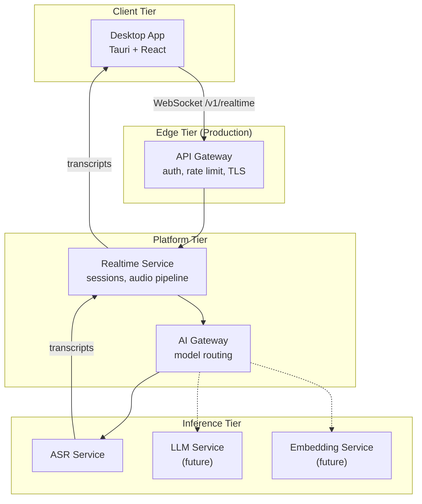
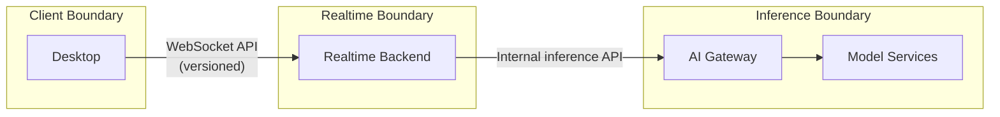
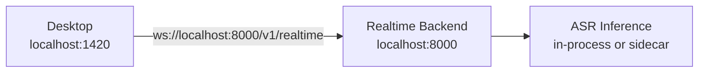
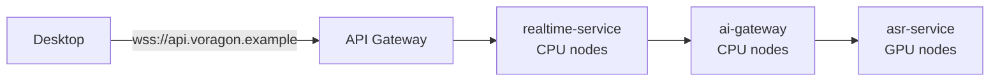

# Architecture Overview

## Purpose

Voragon is designed as an **extensible AI inference platform**, not a single-purpose Whisper application. The initial deliverable is realtime voice-to-text; the architecture must support future capabilities including LLM inference, embeddings, vision, agents, and additional model types without redesigning core boundaries.

## System Context

In local development, the API Gateway is omitted. The Desktop App connects directly to the Realtime Backend on `localhost`.

## Component Responsibilities

| Component | Responsibility | Does NOT do |
|-----------|---------------|-------------|
| **Desktop App** | UI, audio capture, WebSocket client, settings, native OS integration | Model inference, VAD, ASR |
| **Realtime Backend** | WebSocket sessions, audio pipeline orchestration, VAD invocation, transcript delivery | Direct model weight loading (delegates to inference layer) |
| **AI Gateway** | Model routing by capability alias, health checks, versioning, fallback | Audio processing, session management |
| **ASR Service** | Speech-to-text inference | Session lifecycle, client communication |
| **API Gateway** | External auth, rate limiting, TLS termination, routing | Inference, audio processing |

## Service Boundaries

The Desktop App depends only on the **WebSocket API contract** (`/v1/realtime`). It has no knowledge of Whisper, whisper.cpp, faster-whisper, or GPU infrastructure.

## Local vs Cloud Architecture

### Local Development

All components run on the developer's machine. Inference may be in-process (Python binding) or a local sidecar during early phases.

### Cloud Production (Target)

## Engineering Principles

1. **Local-first** — Default development and initial user experience require no cloud dependency.
2. **API-first** — All inter-component communication uses defined, versioned APIs.
3. **Model-agnostic interfaces** — ASR and future model types are accessed through capability aliases (e.g., `asr.default`), not hardcoded model names.
4. **Explicit service boundaries** — Each component has a single, well-defined responsibility.
5. **Realtime latency awareness** — Latency is budgeted per pipeline stage; see [Realtime Audio](realtime-audio.md).
6. **Observable by default** — OpenTelemetry, Prometheus, and structured logging are planned from Phase 2 onward.
7. **Secure by default** — TLS in production, secrets management, minimal data retention.
8. **Platform-specific native functionality isolated behind Rust** — React/TypeScript never calls OS APIs directly.
9. **Kubernetes only when it provides operational value** — Docker Compose for local/multi-container; EKS for production scale.
10. **Optimize based on measurements** — No premature optimization; benchmark before tuning.
11. **Prefer replaceable components** — ASR backend, VAD implementation, and model routing are swappable.
12. **Avoid vendor lock-in where practical** — Model-agnostic gateway; portable container images.
13. **Keep the initial system simple** — One engineer can build and operate the MVP.
14. **Design for horizontal scaling eventually** — Stateless realtime pods; GPU inference scales independently.

## What Voragon Is NOT Building Initially

The following are explicitly deferred. Extension points exist in the architecture, but these are not part of the initial implementation:

| Deferred | Reason |
|----------|--------|
| Service mesh (Istio, Linkerd) | Unnecessary complexity for initial scale |
| Message queues (Kafka, Redis Streams) | No concrete requirement for async event processing yet |
| Multi-region deployment | Single-region MVP is sufficient |
| Multi-cloud | AWS-only initial target |
| Complex agent orchestration | Phase 10+ capability |
| RAG / vector databases | Requires LLM + embedding services first |
| Distributed GPU scheduling frameworks | Single GPU node pool is sufficient initially |
| Model fine-tuning | Out of scope for platform MVP |
| Unnecessary microservices | Start with realtime-service + asr-service; split when justified |

## Non-Functional Requirements

All values below are **engineering targets**, not measured guarantees. No benchmarks have been run yet.

### Latency Targets (End-to-End)

| Metric | Target | Notes |
|--------|--------|-------|
| First partial transcript | < 500 ms after speech onset | Depends on VAD + model warm-up |
| Partial transcript update interval | 200–500 ms | Configurable; trade-off with accuracy |
| Final transcript after speech end | < 300 ms after VAD segment close | Post-processing + model flush |
| Reconnect and resume | < 2 s | Includes WebSocket handshake + session restore |
| End-to-end (speech onset → first partial on screen) | < 800 ms | Sum of all pipeline stages |

### Performance Budget

| Stage | Budget (target) | Notes |
|-------|----------------|-------|
| Audio capture | < 20 ms | OS audio buffer + frame assembly |
| Network (local) | < 5 ms | localhost WebSocket |
| Network (cloud) | < 50 ms | Client to API Gateway RTT |
| VAD | < 30 ms per frame | Silero VAD or equivalent |
| Queue (inference) | < 50 ms | Under normal load |
| Inference (partial) | < 300 ms | Model-dependent; not yet benchmarked |
| Inference (final) | < 200 ms | Segment flush |
| Transcript rendering (UI) | < 16 ms | Single React render frame |

### Resource Targets (Desktop)

| Metric | Target |
|--------|--------|
| CPU utilization (idle) | < 5% |
| CPU utilization (active transcription) | < 15% |
| Memory (desktop process) | < 150 MB |
| Memory (backend process, local) | < 2 GB (includes model) |

### Resource Targets (Backend / Inference)

| Metric | Target (initial) |
|--------|-----------------|
| Concurrent sessions per realtime pod | 50–100 (engineering estimate; not benchmarked) |
| GPU utilization (steady state) | 40–80% |
| GPU memory per ASR session | TBD — depends on model and batching strategy |
| Inference error rate | < 0.1% of audio frames |

### Availability

| Environment | Target |
|-------------|--------|
| Local development | N/A (single user) |
| Production (initial) | 99.5% monthly uptime |
| Production (mature) | 99.9% monthly uptime |

## Extension Points

The architecture defines clear extension points for future capabilities:

| Extension Point | Mechanism | Example |
|----------------|-----------|---------|
| New ASR model | AI Gateway capability alias | `asr.japanese` → Japanese-specialized model |
| New model type | AI Gateway route + new service | `llm.default` → LLM service |
| New desktop feature | Rust command + React UI | System tray, global shortcuts |
| New observability signal | OpenTelemetry span/metric | Per-model inference latency |
| New deployment target | Container image + K8s manifest | Additional GPU node pool |

## Related Documents

- [Desktop Architecture](desktop.md)
- [Backend Architecture](backend.md)
- [Realtime Audio Pipeline](realtime-audio.md)
- [AI Gateway](ai-gateway.md)
- [Model Serving](model-serving.md)
- [Kubernetes Architecture](kubernetes.md)
- [AWS GPU Strategy](aws.md)
- [Development Phases](../roadmap/phases.md)
