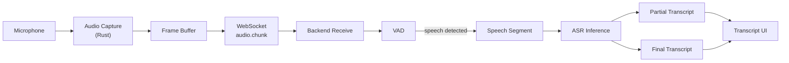
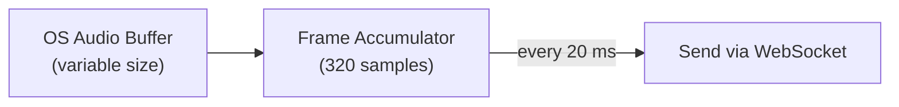
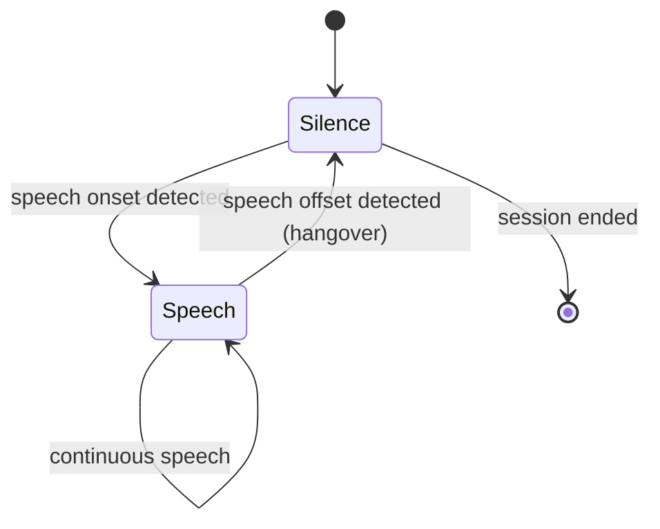
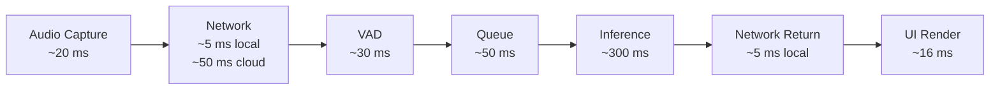
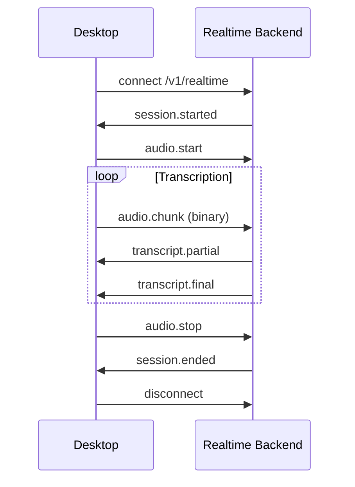
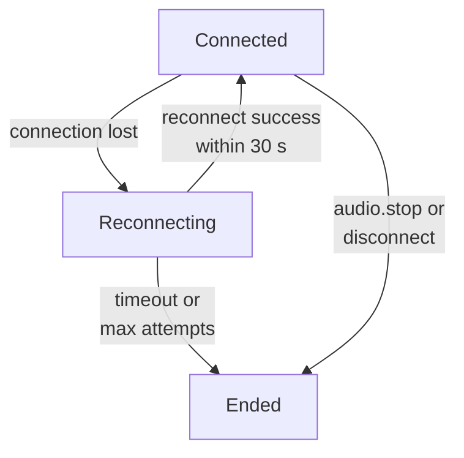

# Realtime Audio Pipeline

## Overview

This document defines the realtime audio pipeline from microphone capture through transcript delivery. It covers format specifications, buffering, VAD, partial/final transcription semantics, latency budgeting, and session lifecycle.

## Pipeline Diagram



## Audio Format Specification

| Parameter | Value | Rationale |
|-----------|-------|-----------|
| Sample rate | 16,000 Hz | Whisper native sample rate; resample at capture if device differs |
| Channels | Mono (1) | ASR models expect mono; downmix stereo at capture |
| Sample format | 16-bit signed PCM (s16le) | Widely supported; sufficient dynamic range for speech |
| Frame duration | 20 ms | Balance between latency and overhead |
| Frame size | 320 samples (640 bytes) | 16000 × 0.020 × 2 bytes |
| Encoding on wire | Raw binary (not JSON) | Audio frames sent as binary WebSocket messages |

### Why 16 kHz Mono

Whisper models are trained on 16 kHz mono audio. Capturing at this rate avoids resampling overhead on the backend. If the OS provides a different rate (e.g., 48 kHz), the Rust audio module resamples to 16 kHz before sending.

### Stereo Handling

If the input device provides stereo, downmix to mono at capture:

```
mono_sample = (left + right) / 2
```

Do not send stereo to the backend.

## Frame Assembly and Buffering

### Desktop (Capture Side)



- The OS audio API delivers buffers of variable size (typically 10–50 ms).
- The Rust audio module accumulates samples until a full 20 ms frame (320 samples) is ready.
- Partial frames at session end are padded with silence or discarded (configurable; default: pad with silence and send).

### Backend (Receive Side)

- Incoming frames are appended to a per-session ring buffer.
- The ring buffer holds up to 30 seconds of audio (engineering default; tunable).
- If the buffer exceeds capacity, oldest frames are dropped and a `buffer.overflow` warning is emitted to the client.

## Voice Activity Detection (VAD)

VAD determines when speech is present, segmenting the continuous audio stream into speech regions for ASR processing.

### VAD Placement

VAD runs on the **backend**, not the desktop. The desktop sends all captured frames; the backend decides what constitutes speech.

Rationale:
- VAD model can be updated without desktop changes
- Consistent VAD behavior across platforms
- Backend can tune VAD sensitivity per session

### Initial VAD Candidate

**Silero VAD** — lightweight, runs on CPU, well-supported in Python ecosystem.

Alternatives considered: WebRTC VAD (simpler but less accurate), pyannote VAD (more accurate but heavier). Silero is the recommended starting point; the VAD implementation is behind an abstraction interface.

### VAD Behavior



| Parameter | Default | Description |
|-----------|---------|-------------|
| `speech_threshold` | 0.5 | Probability threshold for speech detection |
| `min_speech_duration_ms` | 250 | Minimum speech segment length |
| `min_silence_duration_ms` | 500 | Silence duration to close a segment |
| `speech_pad_ms` | 300 | Padding added before/after detected speech |

### VAD Output

When VAD detects a speech segment:

1. Accumulated audio frames for the segment are passed to ASR.
2. While speech is ongoing, partial transcription results are emitted periodically.
3. When the segment closes (silence detected), a final transcription is emitted for that segment.

## Transcription Semantics

### Partial Transcript

- Emitted while speech is ongoing, typically every 200–500 ms.
- Content may change as more audio is processed (later partials may revise earlier text).
- Identified by a `segment_id` and monotonically increasing `sequence` number.
- UI should replace the current partial display, not append.

### Final Transcript

- Emitted when a VAD speech segment closes.
- Content is stable and will not be revised.
- Appended to the transcript history in the UI.
- Identified by the same `segment_id` as its partials, with `is_final: true`.

### Example Transcript Flow

```
[partial]  "Hello"
[partial]  "Hello world"
[partial]  "Hello world how"
[final]    "Hello world how are you"
[partial]  "I'm"
[partial]  "I'm doing"
[final]    "I'm doing well"
```

## Latency Model

End-to-end latency is the sum of independent stages. Each stage should be measured independently.



### Latency Categories

| Category | Description | Target (local) | Target (cloud) |
|----------|-------------|----------------|----------------|
| **Audio capture latency** | Time from sound at microphone to frame sent | < 20 ms | < 20 ms |
| **Network latency (upstream)** | Frame transmission to backend | < 5 ms | < 50 ms |
| **VAD latency** | Frame received to speech onset detected | < 30 ms | < 30 ms |
| **Model queue latency** | Speech segment queued to inference start | < 50 ms | < 50 ms |
| **Inference latency** | Inference start to partial result | < 300 ms | < 300 ms |
| **Network latency (downstream)** | Transcript transmission to desktop | < 5 ms | < 50 ms |
| **Transcript rendering latency** | Message received to visible on screen | < 16 ms | < 16 ms |
| **End-to-end** | Speech onset to first partial on screen | < 800 ms | < 1000 ms |

All values are engineering targets. No benchmarks have been performed.

### What Affects Inference Latency

- Model size (Whisper Large-v3 Turbo vs smaller variants)
- Hardware (Apple Silicon CPU vs NVIDIA GPU)
- Batch size (single-stream realtime vs batched)
- Concurrent sessions sharing GPU
- Model warm-up (first inference after load is slower)

## Backpressure and Dropped Frames

### Backpressure Strategy

The pipeline uses a **drop-oldest** strategy on the backend receive buffer:

1. If the backend cannot process frames fast enough, the ring buffer fills.
2. When the buffer reaches capacity, the oldest frames are discarded.
3. A `buffer.overflow` event is sent to the client with the count of dropped frames.
4. The client may optionally reduce capture rate or display a warning.

The desktop does not implement backpressure on the capture side initially. It captures and sends at a fixed 20 ms frame rate. Backpressure signaling is a future enhancement.

### Dropped Frame Handling

- Dropped frames create gaps in the audio stream.
- VAD may produce shorter or missed segments.
- ASR quality degrades gracefully; no crash or session termination.
- Metrics: `audio.frames_dropped` counter per session.

## Session Lifecycle



### Session States

| State | Description |
|-------|-------------|
| `connecting` | WebSocket handshake in progress |
| `active` | Session established, audio flowing |
| `paused` | Audio stopped but session open (future) |
| `reconnecting` | Connection lost, attempting recovery |
| `ended` | Session closed normally |
| `error` | Session terminated due to error |

## Reconnection Behavior



| Parameter | Value |
|-----------|-------|
| Reconnect attempts | 5 |
| Initial backoff | 1 s |
| Max backoff | 8 s |
| Reconnect window | 30 s (server retains session state) |
| After reconnect window | New session required |

On reconnect within the window:
- Client sends `session.resume` with the previous `session_id`.
- Server restores session state if available.
- Audio streaming resumes from the new connection.
- Transcript history during the disconnect gap is lost (no offline buffering initially).

## Heartbeat

Aligned with [Realtime WebSocket API — Heartbeat](../api/realtime-websocket.md#heartbeat).

| Parameter | Value |
|-----------|-------|
| Client `ping` interval (idle, not streaming) | 15 s |
| Server idle timeout | 45 s (`HEARTBEAT_IDLE_TIMEOUT_S`) |
| Message | `ping` / `pong` (JSON control messages) |

**Liveness:** Any inbound WebSocket message (including `audio.chunk`) resets the idle timer. Clients **SHOULD** send `ping` every 15 s when connected without audio streaming.

**On idle timeout:** P2-001 closes the WebSocket; [P2-002](../roadmap/dev-step-p2-002-session-ended.md) adds `session.ended` with `reason: "timeout"`.

## Ordering Guarantees

| Data | Guarantee |
|------|-----------|
| Audio frames | Processed in sequence number order; out-of-order frames are buffered briefly then dropped |
| Partial transcripts | Per `segment_id`, ordered by `sequence`; UI replaces current partial |
| Final transcripts | Ordered by `segment_id` creation time; appended to history |
| Control messages | Processed in receive order |

## Related Documents

- [Desktop Architecture](desktop.md)
- [Backend Architecture](backend.md)
- [Model Serving](model-serving.md)
- [Realtime WebSocket API](../api/realtime-websocket.md)
- [Transcription API](../api/transcription.md)
