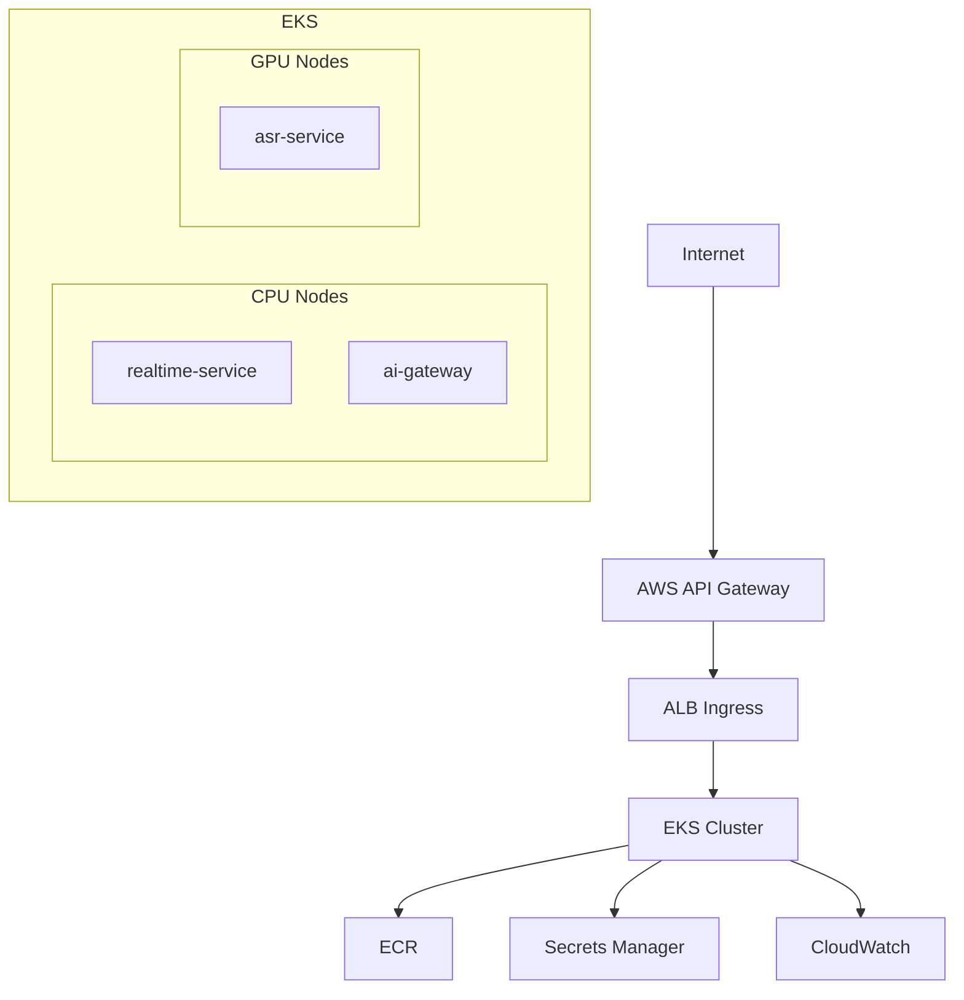

# AWS Deployment

## Overview

This document describes the planned AWS production deployment for Voragon. Introduced in Phase 6 (EKS) with GPU inference in Phase 7.

**Status:** Planned, not implemented.

## Architecture

## Deployment Phases

| Phase | Components | Infrastructure |
|-------|-----------|---------------|
| Phase 6 | realtime-service on EKS | EKS cluster, CPU nodes, ALB, API Gateway |
| Phase 7 | asr-service on GPU nodes | GPU node pool (g5.xlarge) |
| Phase 8 | ai-gateway | Additional CPU deployment |

## Prerequisites

| Resource | Purpose |
|----------|---------|
| AWS Account | Infrastructure hosting |
| EKS Cluster | Container orchestration |
| ECR Repositories | Container image storage |
| VPC with subnets | Network isolation |
| ALB | WebSocket ingress |
| API Gateway | External API entry, auth |
| Secrets Manager | JWT keys, credentials |
| Route 53 (optional) | DNS for `api.voragon.example` |

## Deployment Steps (Planned)

### Phase 6: EKS + Realtime Service

1. Create EKS cluster with CPU node group (m6i.large)
2. Configure ALB Ingress Controller
3. Set up API Gateway with WebSocket support
4. Push container images to ECR
5. Deploy realtime-service (CPU inference initially)
6. Configure health probes and HPA
7. Set up CloudWatch logging
8. Validate WebSocket connectivity from desktop

### Phase 7: GPU Inference

1. Create GPU node group (g5.xlarge)
2. Install NVIDIA device plugin
3. Build and push ASR container image
4. Deploy asr-service with GPU resource requests
5. Configure model weight loading (init container or volume)
6. Update realtime-service to call asr-service
7. Validate inference latency and GPU utilization

### Phase 8: AI Gateway

1. Deploy ai-gateway service
2. Configure model registry (ConfigMap)
3. Update realtime-service to route through ai-gateway
4. Register asr-service in model registry
5. Validate capability alias resolution

## Container Images

| Image | Base | Size (estimated) |
|-------|------|-----------------|
| `voragon/realtime-backend` | python:3.11-slim | ~200 MB |
| `voragon/asr-inference` | nvidia/cuda:12.x-runtime | ~4 GB (includes model) |
| `voragon/ai-gateway` | python:3.11-slim | ~150 MB |

## Configuration Management

| Config | Storage | Phase |
|--------|---------|-------|
| Service settings | ConfigMap | Phase 6 |
| Model registry | ConfigMap | Phase 8 |
| JWT keys | Secrets Manager | Phase 6 |
| Model weights | EBS volume or init container download | Phase 7 |

## DNS and TLS

| Component | Configuration |
|-----------|--------------|
| API endpoint | `api.voragon.example` (Route 53) |
| TLS certificate | ACM certificate on ALB |
| WebSocket URL | `wss://api.voragon.example/v1/realtime` |

## Rollback Strategy

| Scenario | Action |
|----------|--------|
| Bad deployment | `kubectl rollout undo deployment/<name>` |
| Model loading failure | Readiness probe prevents traffic to unhealthy pods |
| GPU node failure | HPA provisions new GPU node; client reconnects |

## Cost Monitoring

- Set up AWS Cost Explorer tags on EKS resources
- Monitor GPU node utilization; scale down during low-traffic periods
- Review monthly: EC2, EKS, ALB, API Gateway, data transfer costs
- See [AWS GPU Strategy](../architecture/aws.md) for cost planning methodology

## Related Documents

- [AWS GPU Strategy](../architecture/aws.md)
- [Kubernetes Architecture](../architecture/kubernetes.md)
- [Observability](observability.md)
- [Local Kubernetes](kubernetes-local.md)
