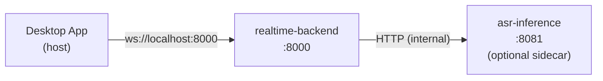

# Docker Compose

## Overview

Docker Compose provides a multi-container local development and testing environment for Voragon. It is introduced in Phase 4, after the single-process local prototype is validated.

**Status:** Planned, not implemented.

## Architecture



The desktop application runs on the host (not containerized) for native audio capture and OS integration. The backend and optional ASR sidecar run in containers.

## Planned Services

| Service | Image | Port | GPU | Description |
|---------|-------|------|-----|-------------|
| `realtime-backend` | `voragon/realtime-backend` | 8000 | No | FastAPI WebSocket service |
| `asr-inference` | `voragon/asr-inference` | 8081 | Optional | ASR inference sidecar (if separated) |

### When to Use ASR Sidecar

| Scenario | ASR Location |
|----------|-------------|
| faster-whisper, in-process | Inside `realtime-backend` container |
| whisper.cpp binary | Separate `asr-inference` container |
| GPU inference (NVIDIA) | Separate `asr-inference` container with GPU access |

## Planned Compose File Structure

```
docker/
├── docker-compose.yml          # Main compose file
├── docker-compose.gpu.yml      # GPU override (NVIDIA)
├── realtime-backend/
│   └── Dockerfile
└── asr-inference/
    └── Dockerfile
```

## Usage (Planned)

```bash
# Start backend (CPU inference, in-process)
docker compose up realtime-backend

# Start with ASR sidecar
docker compose up

# Start with GPU support
docker compose -f docker-compose.yml -f docker-compose.gpu.yml up
```

## Volume Mounts

| Mount | Purpose |
|-------|---------|
| Model weights cache | Avoid re-downloading models on container restart |
| Configuration | Override default settings |

## Networking

- `realtime-backend` exposed on `localhost:8000`
- `asr-inference` accessible only within the Docker network (not exposed to host)
- Desktop connects to `ws://localhost:8000/v1/realtime`

## Health Checks

| Service | Check |
|---------|-------|
| `realtime-backend` | `curl -f http://localhost:8000/health` |
| `asr-inference` | `curl -f http://localhost:8081/health` |

## Related Documents

- [Local Development](local-development.md)
- [Kubernetes Local](kubernetes-local.md)
- [Backend Architecture](../architecture/backend.md)
