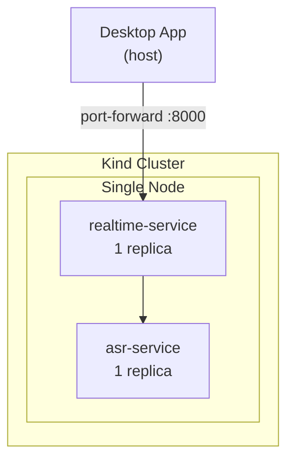

# Local Kubernetes (Kind)

## Overview

A local Kind (Kubernetes in Docker) cluster validates container images, deployment manifests, health probes, and service discovery before deploying to AWS EKS. Introduced in Phase 5.

**Status:** Planned, not implemented.

## Purpose

Kind is used to validate:

- Container images build and run correctly
- Kubernetes manifests (Deployments, Services, ConfigMaps)
- Health probes (liveness, readiness)
- Service-to-service communication
- Port forwarding for desktop connectivity

Kind is **not** used for performance testing or GPU inference validation.

## Architecture



## Prerequisites

| Tool | Purpose |
|------|---------|
| Docker | Kind node runtime |
| Kind | Local Kubernetes cluster |
| kubectl | Cluster management |
| Helm (optional) | Package management |

## Setup (Planned)

```bash
# Create cluster
kind create cluster --name voragon

# Build and load images
docker build -t voragon/realtime-backend:latest ./backend
kind load docker-image voragon/realtime-backend:latest --name voragon

# Apply manifests
kubectl apply -f k8s/local/

# Port forward for desktop access
kubectl port-forward svc/realtime-service 8000:8000
```

## Planned Manifests

```
k8s/
├── local/
│   ├── namespace.yaml
│   ├── realtime-deployment.yaml
│   ├── realtime-service.yaml
│   ├── asr-deployment.yaml
│   ├── asr-service.yaml
│   └── configmap.yaml
└── production/
    ├── ... (Phase 6+)
```

## Differences from Production EKS

| Aspect | Kind (Local) | EKS (Production) |
|--------|-------------|-----------------|
| Nodes | 1 (no GPU) | CPU + GPU node pools |
| Ingress | port-forward | ALB + API Gateway |
| Auth | None | JWT via API Gateway |
| Scaling | Fixed replicas | HPA |
| Storage | Local | EBS |
| Observability | kubectl logs | Prometheus + Grafana |

## Related Documents

- [Docker Compose](docker.md)
- [Kubernetes Architecture](../architecture/kubernetes.md)
- [AWS Deployment](aws-deployment.md)
