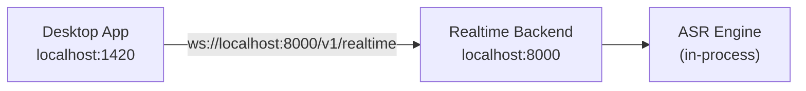
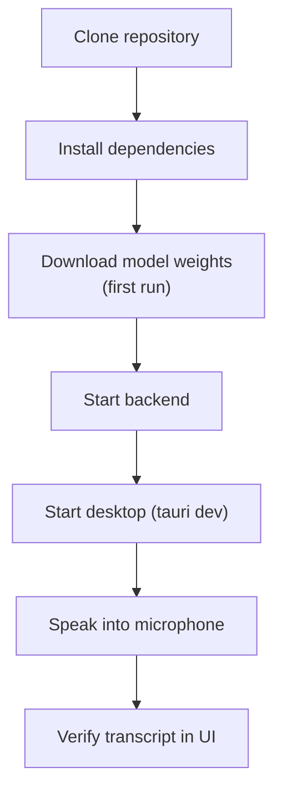

# Local Development

## Overview

This document describes the planned local development setup for Voragon. All components run on the developer's machine with no cloud dependencies.

**Status:** Planned, not implemented.

## Prerequisites

| Tool | Version | Purpose |
|------|---------|---------|
| Python | 3.11+ | Backend runtime |
| Node.js | 20+ | Frontend tooling |
| Rust | 1.77+ | Tauri native layer |
| pnpm or npm | Latest | JavaScript package management |
| Git | Latest | Version control |

### Platform-Specific

| Platform | Additional Requirements |
|----------|----------------------|
| macOS (Apple Silicon) | Xcode Command Line Tools; whisper.cpp recommended for ASR |
| macOS (Intel) | Xcode Command Line Tools |
| Windows | Visual Studio Build Tools; WebView2 runtime |
| Linux (future) | `libwebkit2gtk-4.1-dev`, `libappindicator3-dev` |

### ASR Backend Dependencies

| Backend | Platform | Requirements |
|---------|----------|-------------|
| faster-whisper | NVIDIA GPU or CPU | CUDA toolkit (for GPU); `pip install faster-whisper` |
| whisper.cpp | Apple Silicon or CPU | whisper.cpp binary or `pywhispercpp`; GGUF model file |

## Development Architecture



## Planned Project Structure

```
voragon/
├── desktop/                # Tauri + React application
│   ├── src/                # React frontend
│   └── src-tauri/          # Rust native layer
├── backend/                # FastAPI realtime service
│   ├── app/
│   └── tests/
├── docs/                   # This documentation
├── docker/                 # Docker Compose (Phase 4)
└── k8s/                    # Kubernetes manifests (Phase 5+)
```

## Starting Services (Planned)

### Backend

```bash
cd backend
python -m venv .venv
source .venv/bin/activate  # Windows: .venv\Scripts\activate
pip install -e ".[dev]"
python -m app.main
# Backend available at http://localhost:8000
```

### Desktop

```bash
cd desktop
pnpm install
pnpm tauri dev
# Desktop app launches with hot-reload
```

## Environment Variables (Backend)

| Variable | Default | Description |
|----------|---------|-------------|
| `HOST` | `0.0.0.0` | Bind address |
| `PORT` | `8000` | Bind port |
| `ASR_BACKEND` | `faster_whisper` | ASR adapter (`faster_whisper`, `whisper_cpp`) |
| `ASR_MODEL` | `large-v3-turbo` | Model identifier |
| `LOG_LEVEL` | `debug` | Log level for development |

## Model Download

On first run, the ASR backend downloads model weights:

| Model | Size (approximate) | Location |
|-------|-------------------|----------|
| Whisper Large-v3 Turbo | ~1.5 GB | Hugging Face cache or configured path |
| Silero VAD | ~2 MB | Downloaded automatically |

Model download is a one-time operation per machine.

## Development Workflow



## Testing (Planned)

| Test Type | Tool | Location |
|-----------|------|----------|
| Backend unit tests | pytest | `backend/tests/` |
| Backend integration tests | pytest + httpx | `backend/tests/integration/` |
| WebSocket protocol tests | pytest + websockets | `backend/tests/ws/` |
| Desktop unit tests | vitest | `desktop/src/__tests__/` |
| E2E tests | Manual (Phase 1); automated (Phase 3) | — |

## Troubleshooting (Anticipated)

| Issue | Likely Cause | Resolution |
|-------|-------------|------------|
| Backend fails to start | Missing Python dependencies | `pip install -e ".[dev]"` |
| Model download fails | Network or disk space | Check internet; ensure ~2 GB free |
| No audio in transcript | Microphone permission denied | Check OS microphone permissions |
| High inference latency | CPU-only inference | Use GPU backend or whisper.cpp on Apple Silicon |
| WebSocket connection refused | Backend not running | Start backend before desktop |

## Related Documents

- [Docker Compose Setup](docker.md)
- [Backend Architecture](../architecture/backend.md)
- [Desktop Architecture](../architecture/desktop.md)
- [Model Serving](../architecture/model-serving.md)
