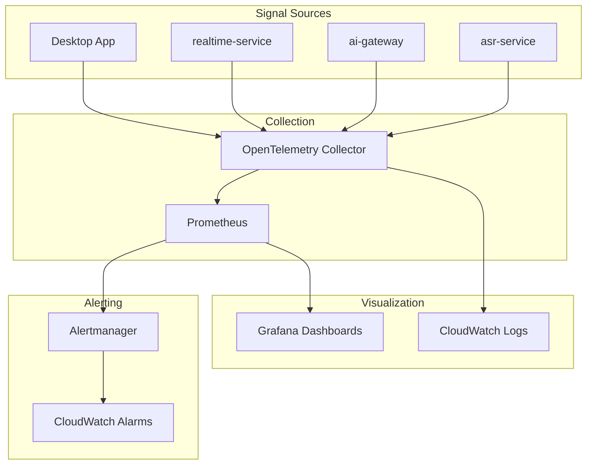

# Observability

## Overview

Voragon's observability strategy covers metrics, distributed tracing, structured logging, and dashboards. Observability is designed in from Phase 2 (basic metrics) and expanded through production deployment.

**Status:** Planned, not implemented.

## Architecture



## Signal Types

### Metrics (Prometheus)

| Metric | Type | Source | Description |
|--------|------|--------|-------------|
| `voragon_sessions_active` | Gauge | realtime-service | Current active sessions |
| `voragon_ws_connections` | Gauge | realtime-service | Active WebSocket connections |
| `voragon_audio_frames_received_total` | Counter | realtime-service | Audio frames received |
| `voragon_audio_frames_dropped_total` | Counter | realtime-service | Frames dropped (buffer overflow) |
| `voragon_vad_segments_total` | Counter | realtime-service | VAD segments detected |
| `voragon_asr_inference_duration_seconds` | Histogram | realtime-service, asr-service | ASR inference latency |
| `voragon_asr_inference_errors_total` | Counter | asr-service | ASR inference failures |
| `voragon_transcript_partial_total` | Counter | realtime-service | Partial transcripts emitted |
| `voragon_transcript_final_total` | Counter | realtime-service | Final transcripts emitted |
| `voragon_first_partial_latency_seconds` | Histogram | realtime-service | Time from speech onset to first partial |
| `voragon_end_to_end_latency_seconds` | Histogram | realtime-service | Speech onset to transcript on wire |
| `voragon_gpu_utilization` | Gauge | asr-service | GPU utilization percentage |
| `voragon_gpu_memory_used_bytes` | Gauge | asr-service | GPU memory usage |
| `voragon_inference_queue_depth` | Gauge | asr-service | Pending inference requests |
| `voragon_model_load_duration_seconds` | Gauge | asr-service | Model loading time at startup |

### Distributed Tracing (OpenTelemetry)

| Span | Service | Attributes |
|------|---------|------------|
| `ws.session` | realtime-service | session_id, duration |
| `audio.frame.process` | realtime-service | seq_num, frame_size |
| `vad.detect` | realtime-service | segment_id, speech_duration |
| `asr.inference` | asr-service | model, segment_id, is_final, latency |
| `gateway.route` | ai-gateway | capability, resolved_model |
| `transcript.emit` | realtime-service | type (partial/final), segment_id |

Trace context propagated via W3C Trace Context headers on internal HTTP calls.

### Structured Logging

All services emit JSON logs to stdout:

```json
{
  "timestamp": "2026-09-19T03:25:00.000Z",
  "level": "info",
  "service": "realtime-service",
  "trace_id": "abc123",
  "session_id": "session-uuid",
  "message": "transcript.final emitted",
  "segment_id": "seg-uuid",
  "latency_ms": 280
}
```

**Logging rules:**
- Never log audio content
- Never log transcript text by default (opt-in via config)
- Always log session_id and trace_id for correlation
- Log levels: `debug` (dev), `info` (prod), `warn`, `error`

## Dashboards (Planned)

### Realtime Overview

| Panel | Metric |
|-------|--------|
| Active sessions | `voragon_sessions_active` |
| WebSocket connections | `voragon_ws_connections` |
| Audio throughput | `rate(voragon_audio_frames_received_total[1m])` |
| Dropped frames | `rate(voragon_audio_frames_dropped_total[1m])` |

### Latency

| Panel | Metric |
|-------|--------|
| First partial latency (p50, p95, p99) | `voragon_first_partial_latency_seconds` |
| ASR inference latency (p50, p95, p99) | `voragon_asr_inference_duration_seconds` |
| End-to-end latency (p50, p95, p99) | `voragon_end_to_end_latency_seconds` |
| Inference queue depth | `voragon_inference_queue_depth` |

### GPU

| Panel | Metric |
|-------|--------|
| GPU utilization | `voragon_gpu_utilization` |
| GPU memory usage | `voragon_gpu_memory_used_bytes` |
| Inference errors | `rate(voragon_asr_inference_errors_total[5m])` |
| Model load time | `voragon_model_load_duration_seconds` |

## Alerts (Planned)

| Alert | Condition | Severity |
|-------|-----------|----------|
| High inference latency | p95 > 1s for 5 min | Warning |
| ASR error rate | > 1% for 5 min | Critical |
| GPU memory near limit | > 90% for 5 min | Warning |
| No healthy ASR pods | 0 ready replicas for 2 min | Critical |
| High dropped frame rate | > 5% for 5 min | Warning |
| Session count near limit | > 80% capacity for 10 min | Warning |

## Implementation Phases

| Phase | Observability Level |
|-------|-------------------|
| Phase 1 | Structured JSON logging to stdout |
| Phase 2 | Prometheus metrics on realtime-service; basic Grafana dashboard |
| Phase 4 | Container-level metrics via Docker |
| Phase 6 | OpenTelemetry tracing; CloudWatch integration |
| Phase 7 | GPU metrics; inference latency dashboards |
| Phase 8 | AI Gateway routing metrics |

## Local Development

During local development:
- Logs: stdout (human-readable in dev, JSON in staging)
- Metrics: `http://localhost:8000/metrics` (Prometheus format)
- Tracing: Optional local Jaeger via Docker (not required)

## Related Documents

- [Architecture Overview](../architecture/overview.md)
- [Backend Architecture](../architecture/backend.md)
- [AWS Deployment](aws-deployment.md)
