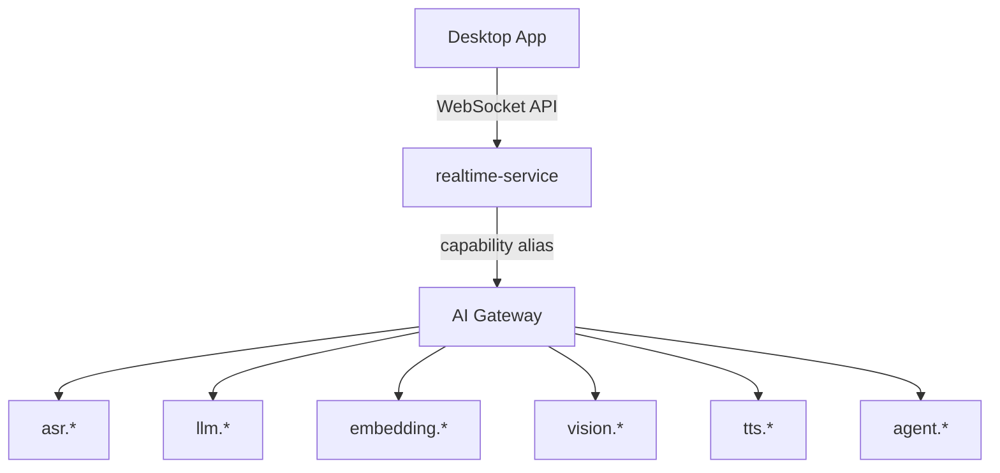

# Future Capabilities

## Overview

This document describes planned future capabilities and extension points in the Voragon architecture. None of these are part of the initial implementation. They are documented to ensure the current architecture can accommodate them without redesign.

## Extension Points

## Planned Capabilities

### LLM Inference (Phase 9+)

| Aspect | Plan |
|--------|------|
| Use case | Contextual AI assistance, conversation, summarization |
| Service | `llm-service` on GPU nodes |
| Capability alias | `llm.default`, `llm.fast` |
| Backend candidates | vLLM, Text Generation Inference (TGI), Ollama |
| Integration | AI Gateway routes `llm.*` requests to llm-service |

### Embeddings (Phase 9+)

| Aspect | Plan |
|--------|------|
| Use case | Semantic search, document understanding, RAG (future) |
| Service | `embedding-service` on CPU or GPU nodes |
| Capability alias | `embedding.default` |
| Backend candidates | sentence-transformers, Text Embeddings Inference (TEI) |

### Vision (Future)

| Aspect | Plan |
|--------|------|
| Use case | Screen understanding, image analysis |
| Service | `vision-service` on GPU nodes |
| Capability alias | `vision.default` |
| Backend candidates | TBD based on requirements |

### Text-to-Speech (Future)

| Aspect | Plan |
|--------|------|
| Use case | Voice responses from AI assistant |
| Service | `tts-service` |
| Capability alias | `tts.default` |
| Backend candidates | TBD |

### Agent Orchestration (Phase 10+)

| Aspect | Plan |
|--------|------|
| Use case | Multi-step AI tasks, tool use, autonomous workflows |
| Service | `agent-service` or orchestration within realtime-service |
| Integration | Calls LLM, embedding, and other services via AI Gateway |
| Note | Keep simple initially; avoid complex orchestration frameworks |

## Native Desktop Features (Future)

| Feature | Phase | Platform |
|---------|-------|----------|
| Display-capture privacy | Phase 3+ | macOS, Windows |
| Always-on-top window | Phase 3+ | macOS, Windows |
| Local transcript history | Phase 3+ | All |
| On-device inference | Future | Platform-dependent |
| Linux support | Future | Linux |
| Mobile clients | Future | iOS, Android (separate architecture decision required) |

## Infrastructure Evolution

### What May Be Added (When Justified)

| Component | Trigger for Introduction |
|-----------|----------------------|
| Redis | Cross-pod session state required |
| Message queue (SQS, etc.) | Async event processing required |
| Vector database | RAG capability needed |
| Multi-region | User base requires geographic distribution |
| CDN | Static assets or model caching at edge |
| Service mesh | mTLS, advanced traffic management at scale |

### What Is Explicitly Deferred

| Component | Reason |
|-----------|--------|
| Kafka | No event streaming requirement |
| Multi-cloud | AWS-only initial target |
| Model fine-tuning pipeline | Out of scope |
| Distributed GPU scheduling | Single node pool sufficient initially |
| Custom model training | Out of scope |

## Language Support

| Phase | Languages |
|-------|-----------|
| Phase 1 | English |
| Phase 9+ | Additional languages via capability aliases |

Whisper supports 99 languages natively. Adding a language requires:
1. Client sends `language` parameter
2. Optionally, a language-specific model via AI Gateway alias for improved accuracy

## Privacy and Compliance (Future)

| Capability | Plan |
|-----------|------|
| Local-only mode | No data leaves the machine (already supported in local-first architecture) |
| Transcript encryption at rest | Optional local encryption for transcript history |
| Data retention policies | Configurable transcript retention and deletion |
| Audit logging | Enterprise audit trail for transcript access |
| GDPR compliance | Data export and deletion capabilities |

## Open Questions

These require further investigation when the relevant phase approaches:

| Question | Relevant Phase |
|----------|---------------|
| Optimal partial transcription interval (200 ms vs 500 ms) | Phase 1 (benchmark) |
| Concurrent sessions per g5.xlarge | Phase 7 (benchmark) |
| whisper.cpp vs faster-whisper latency on target hardware | Phase 1 (benchmark) |
| WebSocket sticky session vs external session store | Phase 6 |
| LLM model selection for assistant features | Phase 9 |
| On-device inference feasibility per platform | Future |
| Cost per concurrent user at scale | Phase 7 |

## Related Documents

- [Development Phases](phases.md)
- [Architecture Overview](../architecture/overview.md)
- [AI Gateway](../architecture/ai-gateway.md)
