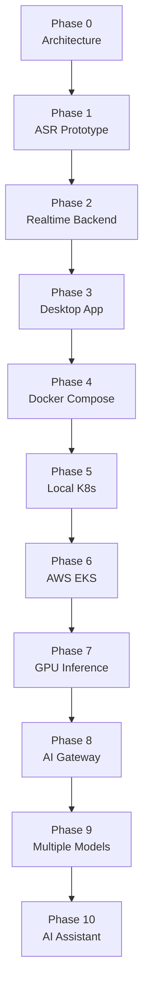
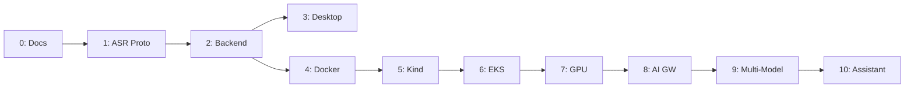

# Development Phases

## Overview

Voragon development proceeds in defined phases, each building on the previous. Phases are designed so that one engineer can build and operate the system through Phase 5.



---

## Phase 0: Architecture and Documentation

**Status:** Complete

Dev-steps for implementation: [dev-steps-index.md](dev-steps-index.md)

**Goal:** Establish technical foundation before writing application code.

**Deliverables:**
- Architecture documentation (this repository)
- Architecture Decision Records (ADRs)
- WebSocket API specification
- Development roadmap

**Dependencies:** None

**Exit criteria:**
- All documentation reviewed and internally consistent
- API contract defined
- Technology choices documented with trade-offs

---

## Phase 1: Local Single-User ASR Prototype

**Status:** In progress — [P1-006](dev-step-p1-006-transcript-partial-final.md) is next.

**Goal:** Validate the core audio → VAD → ASR → transcript pipeline on a single machine.

**Deliverables:**
- Python backend with FastAPI
- WebSocket endpoint (`/v1/realtime`)
- Audio frame reception
- VAD integration (Silero)
- ASR adapter (faster-whisper or whisper.cpp)
- Partial and final transcript emission
- Basic CLI or minimal web UI for testing (not the Tauri app)

**Architecture:**

```
Test Client → WebSocket → Backend → VAD → ASR → Transcript
```

**Dependencies:** Phase 0

**Exit criteria:**
- Speak into microphone (via test client) and receive transcripts
- Partial transcripts update in realtime
- Final transcripts emitted on speech segment close
- English transcription works with Whisper Large-v3 Turbo

---

## Phase 2: Realtime Production-Like Backend

**Goal:** Harden the backend for production patterns.

**Deliverables:**
- Session management (create, resume, end)
- Reconnection support (30-second window)
- Heartbeat (ping/pong)
- Sequence numbers and ordering
- Prometheus metrics
- Structured JSON logging
- Error handling per API spec
- Backend unit and integration tests

**Dependencies:** Phase 1

**Exit criteria:**
- Sessions survive disconnect/reconnect within window
- Metrics available at `/metrics`
- Error codes match API specification
- Test suite passes

---

## Phase 3: Tauri Desktop Application

**Goal:** Build the cross-platform desktop client.

**Deliverables:**
- Tauri 2 project setup (macOS + Windows)
- Rust audio capture module (16 kHz mono PCM)
- React UI with transcript display
- WebSocket client (connect, stream audio, render transcripts)
- Connection status indicator
- Settings (backend URL, audio device)
- System tray (basic)
- Global shortcuts (start/stop transcription)

**Architecture:**

```
Desktop (Tauri) → WebSocket → Backend → VAD → ASR → Transcript → Desktop
```

**Dependencies:** Phase 2

**Exit criteria:**
- Desktop captures microphone audio and displays realtime transcripts
- Works on macOS and Windows
- Reconnection works per API spec
- System tray and global shortcuts functional

---

## Phase 4: Local Docker Compose

**Goal:** Containerize backend services for reproducible local development.

**Deliverables:**
- Dockerfile for realtime-backend
- Docker Compose configuration
- Optional ASR sidecar container
- Model weight volume caching
- Documentation for Docker-based development

**Dependencies:** Phase 2 (backend stable)

**Exit criteria:**
- `docker compose up` starts a working backend
- Desktop connects to containerized backend
- Model weights persist across container restarts

---

## Phase 5: Local Kubernetes (Kind)

**Goal:** Validate Kubernetes deployment patterns locally.

**Deliverables:**
- Kind cluster configuration
- Kubernetes manifests (Deployments, Services, ConfigMaps)
- Health probes (liveness, readiness)
- Port forwarding for desktop access
- Basic deployment documentation

**Dependencies:** Phase 4 (container images exist)

**Exit criteria:**
- Services deploy and pass health checks on Kind
- Desktop connects via port-forward
- Rolling restart works without manual intervention

---

## Phase 6: AWS EKS

**Goal:** Deploy to production Kubernetes on AWS.

**Deliverables:**
- EKS cluster with CPU node pool
- ALB Ingress for WebSocket
- API Gateway with authentication
- ECR container registry
- realtime-service deployment
- CloudWatch logging
- DNS and TLS configuration

**Dependencies:** Phase 5 (K8s manifests validated)

**Exit criteria:**
- Desktop connects to production WebSocket endpoint
- Authentication works
- Transcription works (CPU inference initially)
- Logs visible in CloudWatch

---

## Phase 7: GPU Inference

**Goal:** Move ASR inference to GPU nodes for production performance.

**Deliverables:**
- GPU node pool (g5.xlarge)
- NVIDIA device plugin
- asr-service deployment with GPU resources
- Model weight loading strategy
- GPU utilization metrics
- Inference latency validation

**Dependencies:** Phase 6 (EKS running)

**Exit criteria:**
- ASR inference runs on GPU
- Inference latency meets engineering targets (to be measured)
- GPU metrics visible in dashboards
- Horizontal scaling of ASR pods works

---

## Phase 8: AI Gateway

**Goal:** Introduce model abstraction and routing.

**Deliverables:**
- ai-gateway service
- Model registry (ConfigMap)
- Capability alias resolution (`asr.default` → `whisper-large-v3-turbo`)
- Health checking and fallback
- realtime-service updated to route through AI Gateway

**Dependencies:** Phase 7 (inference service stable)

**Exit criteria:**
- realtime-service calls AI Gateway, not ASR directly
- Model can be changed via config without code changes
- Unhealthy model triggers fallback or error

---

## Phase 9: Multiple AI Models

**Goal:** Expand beyond single ASR model.

**Deliverables:**
- Additional ASR capability aliases (`asr.fast`, `asr.accurate`)
- LLM service (basic)
- Embedding service (basic)
- Model selection in desktop settings
- Multi-model GPU scheduling evaluation

**Dependencies:** Phase 8 (AI Gateway operational)

**Exit criteria:**
- Multiple ASR models routable via capability aliases
- At least one non-ASR model type (LLM or embedding) callable via AI Gateway
- Desktop settings allow model selection

---

## Phase 10: Full AI Assistant

**Goal:** Evolve from transcription tool to contextual AI assistant.

**Deliverables:**
- Contextual AI assistance (LLM-powered)
- Conversation history management
- Agent capabilities (basic)
- Additional native integrations
- Display-capture privacy feature

**Dependencies:** Phase 9 (multiple models available)

**Exit criteria:** TBD — defined when Phase 9 nears completion.

---

## Phase Dependencies Summary



| Phase | Can Start After | Parallel With |
|-------|----------------|---------------|
| 1 | 0 | — |
| 2 | 1 | — |
| 3 | 2 | 4 |
| 4 | 2 | 3 |
| 5 | 4 | — |
| 6 | 5 | — |
| 7 | 6 | — |
| 8 | 7 | — |
| 9 | 8 | — |
| 10 | 9 | — |

Phases 3 and 4 can proceed in parallel after Phase 2 is complete.

## Recommended Next Step

**[P1-005: ASR adapter and model load](dev-step-p1-005-asr-adapter.md)**

See [dev-steps-index.md](dev-steps-index.md) for the full Phase 1 breakdown.

## Related Documents

- [Future Capabilities](future.md)
- [Architecture Overview](../architecture/overview.md)
- [Local Development](../operations/local-development.md)
